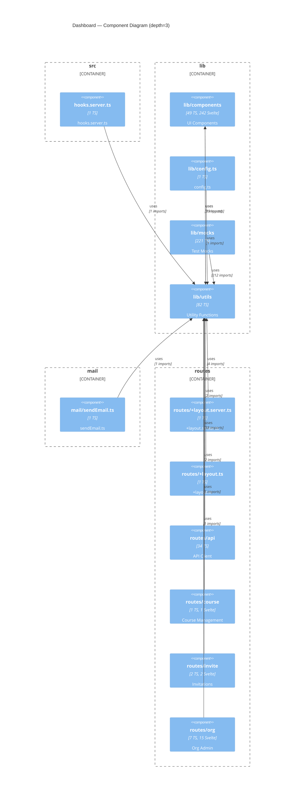

# Layer 3 — Dashboard Components

> **Extraction warnings:**
> - "src/lib/components" has 291 files (ts:32 svelte:242) — consider --dashboard-depth=4
> - "src/lib/mocks" has 221 files (ts:221 svelte:0) — consider --dashboard-depth=4
> - "src/lib/utils" has 82 files (ts:65 svelte:0) — consider --dashboard-depth=4

_Generated 2026-03-13 from AST extraction. Re-run `extract.ts` + `generate-diagrams.ts` to update._

## Components

| Key | TS files | Svelte files | Description |
|-----|----------|--------------|-------------|
| `src/hooks.server.ts` | 1 | 0 | hooks.server.ts |
| `src/lib/components` | 49 | 242 | UI Components |
| `src/lib/config.ts` | 1 | 0 | config.ts |
| `src/lib/mocks` | 221 | 0 | Test Mocks |
| `src/lib/utils` | 82 | 0 | Utility Functions |
| `src/mail/sendEmail.ts` | 1 | 0 | sendEmail.ts |
| `src/routes/+error.svelte` | 0 | 1 | +error.svelte |
| `src/routes/+layout.server.ts` | 1 | 0 | +layout.server.ts |
| `src/routes/+layout.svelte` | 0 | 1 | +layout.svelte |
| `src/routes/+layout.ts` | 1 | 0 | +layout.ts |
| `src/routes/+page.svelte` | 0 | 1 | +page.svelte |
| `src/routes/404` | 0 | 1 | 404 |
| `src/routes/api` | 34 | 0 | API Client |
| `src/routes/course` | 1 | 1 | Course Management |
| `src/routes/courses` | 13 | 14 | Courses |
| `src/routes/csp-report` | 1 | 0 | csp-report |
| `src/routes/forgot` | 0 | 1 | forgot |
| `src/routes/home` | 0 | 1 | Home |
| `src/routes/invite` | 2 | 2 | Invitations |
| `src/routes/lms` | 1 | 9 | Student LMS |
| `src/routes/login` | 0 | 1 | Login |
| `src/routes/logout` | 0 | 1 | logout |
| `src/routes/onboarding` | 0 | 1 | Onboarding |
| `src/routes/org` | 7 | 15 | Org Admin |
| `src/routes/profile` | 1 | 1 | Profile |
| `src/routes/reset` | 0 | 1 | reset |
| `src/routes/signup` | 0 | 1 | Sign Up |
| `src/routes/upgrade` | 0 | 1 | Upgrade / Billing |
| `src/routes/verify-email-error` | 0 | 1 | verify-email-error |

## Top External Dependencies

| Package | Import count |
|---------|-------------|
| `svelte` | 36 |
| `@sveltejs/kit` | 31 |
| `$env` | 17 |
| `$app` | 15 |
| `@supabase/supabase-js` | 8 |
| `dayjs` | 6 |
| `lodash` | 5 |
| `openai-edge` | 4 |
| `ai` | 4 |
| `carbon-icons-svelte` | 4 |