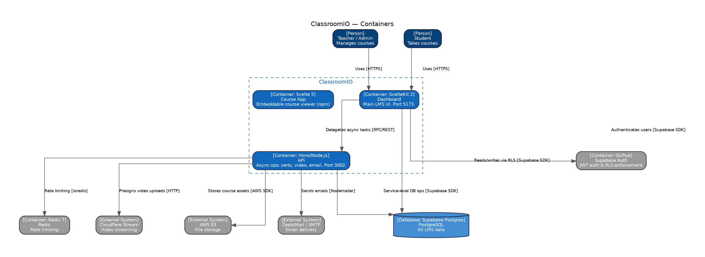

# C4 L2 — Containers (DOT)

_DOT (Graphviz) version. See [Mermaid version](../l2-containers.md) for the elements table and description._

Render with: `dot -Tsvg file.dot.md -o out.svg` (after extracting the code block) or paste into [Graphviz Online](https://dreampuf.github.io/GraphvizOnline/).

## Diagram

