# C4 L3 — Dashboard (SvelteKit) Components (DOT)

_DOT (Graphviz) version. See [Mermaid version](../l3-dashboard.md) for the elements table and description._

Render with: `dot -Tsvg file.dot.md -o out.svg` (after extracting the code block) or paste into [Graphviz Online](https://dreampuf.github.io/GraphvizOnline/).

## Diagram

```dot
digraph L3_dashboard {
  graph [label="Dashboard (SvelteKit) — Components", labelloc=t, fontsize=14, fontname="Helvetica", rankdir=LR, splines=ortho, pad=0.6, nodesep=0.5, ranksep=1.5, compound=true]
  edge [fontname="Helvetica", fontsize=8, color="#555555"]

  // External systems
  ext_supabase [label="[External]\nSupabase\nDatabase & Auth", shape=box, style="filled,rounded", fillcolor="#999999", fontcolor="white", fontname="Helvetica", fontsize=10]
  ext_api [label="[External]\nAPI\nHono backend", shape=box, style="filled,rounded", fillcolor="#999999", fontcolor="white", fontname="Helvetica", fontsize=10]

  subgraph cluster_bound {
    label="Dashboard (SvelteKit)"
    style=dashed
    color="#1168BD"
    fontcolor="#1168BD"
    fontname="Helvetica"
    fontsize=12

    subgraph cluster_g0 {
      label="UI Components (lib/components/)"
      style=filled
      fillcolor="#EBF3FB"
      color="#4A7FC1"
      fontcolor="#4A7FC1"
      fontname="Helvetica"
      fontsize=10
      das_lib_components_Analytics [label="lib/components/Analytics\n3 svelte + 1 ts\nUI components (Svelte)", shape=box, style="filled,rounded", fillcolor="#4A7FC1", fontcolor="white", fontname="Helvetica", fontsize=9]
      das_lib_components_Apps [label="lib/components/Apps\n9 svelte + 6 ts\nUI components (Svelte)", shape=box, style="filled,rounded", fillcolor="#4A7FC1", fontcolor="white", fontname="Helvetica", fontsize=9]
      das_lib_components_Confetti [label="lib/components/Confetti\n1 svelte + 1 ts\nUI components (Svelte)", shape=box, style="filled,rounded", fillcolor="#4A7FC1", fontcolor="white", fontname="Helvetica", fontsize=9]
      das_lib_components_Course [label="lib/components/Course\n68 svelte + 23 ts\nUI components (Svelte)", shape=box, style="filled,rounded", fillcolor="#4A7FC1", fontcolor="white", fontname="Helvetica", fontsize=9]
      das_lib_components_CourseLandingPage [label="lib/components/CourseLandingPage\n15 svelte + 4 ts\nUI components (Svelte)", shape=box, style="filled,rounded", fillcolor="#4A7FC1", fontcolor="white", fontname="Helvetica", fontsize=9]
      das_lib_components_Courses [label="lib/components/Courses\n7 svelte + 3 ts\nUI components (Svelte)", shape=box, style="filled,rounded", fillcolor="#4A7FC1", fontcolor="white", fontname="Helvetica", fontsize=9]
      das_lib_components_Navigation [label="lib/components/Navigation\n7 svelte + 1 ts\nUI components (Svelte)", shape=box, style="filled,rounded", fillcolor="#4A7FC1", fontcolor="white", fontname="Helvetica", fontsize=9]
      das_lib_components_Org [label="lib/components/Org\n44 svelte + 2 ts\nUI components (Svelte)", shape=box, style="filled,rounded", fillcolor="#4A7FC1", fontcolor="white", fontname="Helvetica", fontsize=9]
      das_lib_components_Page [label="lib/components/Page\n5 svelte + 1 ts\nUI components (Svelte)", shape=box, style="filled,rounded", fillcolor="#4A7FC1", fontcolor="white", fontname="Helvetica", fontsize=9]
      das_lib_components_PrimaryButton [label="lib/components/PrimaryButton\n1 svelte + 1 ts\nUI components (Svelte)", shape=box, style="filled,rounded", fillcolor="#4A7FC1", fontcolor="white", fontname="Helvetica", fontsize=9]
      das_lib_components_Question [label="lib/components/Question\n6 svelte + 1 ts\nUI components (Svelte)", shape=box, style="filled,rounded", fillcolor="#4A7FC1", fontcolor="white", fontname="Helvetica", fontsize=9]
      das_lib_components_Snackbar [label="lib/components/Snackbar\n1 svelte + 2 ts\nUI components (Svelte)", shape=box, style="filled,rounded", fillcolor="#4A7FC1", fontcolor="white", fontname="Helvetica", fontsize=9]
      das_lib_components_TextEditor [label="lib/components/TextEditor\n2 svelte + 1 ts\nUI components (Svelte)", shape=box, style="filled,rounded", fillcolor="#4A7FC1", fontcolor="white", fontname="Helvetica", fontsize=9]
      das_lib_components_UploadWidget [label="lib/components/UploadWidget\n1 svelte + 1 ts\nUI components (Svelte)", shape=box, style="filled,rounded", fillcolor="#4A7FC1", fontcolor="white", fontname="Helvetica", fontsize=9]
      das_lib_components_WelcomeModal [label="lib/components/WelcomeModal\n1 svelte + 1 ts\nUI components (Svelte)", shape=box, style="filled,rounded", fillcolor="#4A7FC1", fontcolor="white", fontname="Helvetica", fontsize=9]
    }
    subgraph cluster_g1 {
      label="Utilities (lib/utils/)"
      style=filled
      fillcolor="#EDF7ED"
      color="#57A660"
      fontcolor="#57A660"
      fontname="Helvetica"
      fontsize=10
      das_lib_utils_constants [label="lib/utils/constants\n9 ts\nUtility functions", shape=box, style="filled,rounded", fillcolor="#57A660", fontcolor="white", fontname="Helvetica", fontsize=9]
      das_lib_utils_functions [label="lib/utils/functions\n38 ts\nUtility functions", shape=box, style="filled,rounded", fillcolor="#57A660", fontcolor="white", fontname="Helvetica", fontsize=9]
      das_lib_utils_services [label="lib/utils/services\n21 ts\nData access & business logic", shape=box, style="filled,rounded", fillcolor="#57A660", fontcolor="white", fontname="Helvetica", fontsize=9]
      das_lib_utils_store [label="lib/utils/store\n5 ts\nReactive state stores", shape=box, style="filled,rounded", fillcolor="#57A660", fontcolor="white", fontname="Helvetica", fontsize=9]
      das_lib_utils_types [label="lib/utils/types\n9 ts\nUtility functions", shape=box, style="filled,rounded", fillcolor="#57A660", fontcolor="white", fontname="Helvetica", fontsize=9]
    }
    subgraph cluster_g2 {
      label="Server Routes (routes/api/)"
      style=filled
      fillcolor="#FDF3E7"
      color="#C47D2E"
      fontcolor="#C47D2E"
      fontname="Helvetica"
      fontsize=10
      das_routes_api_admin [label="routes/api/admin\n2 ts\nRoute handlers", shape=box, style="filled,rounded", fillcolor="#C47D2E", fontcolor="white", fontname="Helvetica", fontsize=9]
      das_routes_api_analytics [label="routes/api/analytics\n2 ts\nRoute handlers", shape=box, style="filled,rounded", fillcolor="#C47D2E", fontcolor="white", fontname="Helvetica", fontsize=9]
      das_routes_api_completion [label="routes/api/completion\n4 ts\nRoute handlers", shape=box, style="filled,rounded", fillcolor="#C47D2E", fontcolor="white", fontname="Helvetica", fontsize=9]
      das_routes_api_courses [label="routes/api/courses\n7 ts\nRoute handlers", shape=box, style="filled,rounded", fillcolor="#C47D2E", fontcolor="white", fontname="Helvetica", fontsize=9]
      das_routes_api_domain [label="routes/api/domain\n1 ts\nRoute handlers", shape=box, style="filled,rounded", fillcolor="#C47D2E", fontcolor="white", fontname="Helvetica", fontsize=9]
      das_routes_api_email [label="routes/api/email\n11 ts\nRoute handlers", shape=box, style="filled,rounded", fillcolor="#C47D2E", fontcolor="white", fontname="Helvetica", fontsize=9]
      das_routes_api_org [label="routes/api/org\n2 ts\nRoute handlers", shape=box, style="filled,rounded", fillcolor="#C47D2E", fontcolor="white", fontname="Helvetica", fontsize=9]
      das_routes_api_polar [label="routes/api/polar\n3 ts\nRoute handlers", shape=box, style="filled,rounded", fillcolor="#C47D2E", fontcolor="white", fontname="Helvetica", fontsize=9]
      das_routes_api_unsplash [label="routes/api/unsplash\n1 ts\nRoute handlers", shape=box, style="filled,rounded", fillcolor="#C47D2E", fontcolor="white", fontname="Helvetica", fontsize=9]
      das_routes_api_verify [label="routes/api/verify\n1 ts\nRoute handlers", shape=box, style="filled,rounded", fillcolor="#C47D2E", fontcolor="white", fontname="Helvetica", fontsize=9]
    }
    subgraph cluster_g3 {
      label="Page Routes (routes/)"
      style=filled
      fillcolor="#F3EFF8"
      color="#7B68A8"
      fontcolor="#7B68A8"
      fontname="Helvetica"
      fontsize=10
      das_routes_course_slug_ [label="routes/course/[slug]\n1 svelte + 1 ts\nRoute handlers", shape=box, style="filled,rounded", fillcolor="#7B68A8", fontcolor="white", fontname="Helvetica", fontsize=9]
      das_routes_courses_id_ [label="routes/courses/[id]\n14 svelte + 13 ts\nRoute handlers", shape=box, style="filled,rounded", fillcolor="#7B68A8", fontcolor="white", fontname="Helvetica", fontsize=9]
      das_routes_csp_report [label="routes/csp-report\n1 ts\nRoute handlers", shape=box, style="filled,rounded", fillcolor="#7B68A8", fontcolor="white", fontname="Helvetica", fontsize=9]
      das_routes_invite_s [label="routes/invite/s\n1 svelte + 1 ts\nRoute handlers", shape=box, style="filled,rounded", fillcolor="#7B68A8", fontcolor="white", fontname="Helvetica", fontsize=9]
      das_routes_invite_t [label="routes/invite/t\n1 svelte + 1 ts\nRoute handlers", shape=box, style="filled,rounded", fillcolor="#7B68A8", fontcolor="white", fontname="Helvetica", fontsize=9]
      das_routes_lms_community [label="routes/lms/community\n3 svelte + 1 ts\nRoute handlers", shape=box, style="filled,rounded", fillcolor="#7B68A8", fontcolor="white", fontname="Helvetica", fontsize=9]
      das_routes_org_slug_ [label="routes/org/[slug]\n15 svelte + 7 ts\nRoute handlers", shape=box, style="filled,rounded", fillcolor="#7B68A8", fontcolor="white", fontname="Helvetica", fontsize=9]
      das_routes_profile_id_ [label="routes/profile/[id]\n1 svelte + 1 ts\nRoute handlers", shape=box, style="filled,rounded", fillcolor="#7B68A8", fontcolor="white", fontname="Helvetica", fontsize=9]
    }
    subgraph cluster_g4 {
      label="Other"
      style=filled
      fillcolor="#F5F5F5"
      color="#777777"
      fontcolor="#777777"
      fontname="Helvetica"
      fontsize=10
      das_lib [label="lib\n1 ts\nLib", shape=box, style="filled,rounded", fillcolor="#777777", fontcolor="white", fontname="Helvetica", fontsize=9]
      das_mail [label="mail\n1 ts\nEmail handling", shape=box, style="filled,rounded", fillcolor="#777777", fontcolor="white", fontname="Helvetica", fontsize=9]
      das_root [label="root\n1 ts\nRoot", shape=box, style="filled,rounded", fillcolor="#777777", fontcolor="white", fontname="Helvetica", fontsize=9]
      das_routes [label="routes\n3 svelte + 2 ts\nRoute handlers", shape=box, style="filled,rounded", fillcolor="#777777", fontcolor="white", fontname="Helvetica", fontsize=9]
    }
  }

  // Relationships
  das_routes_api_courses -> das_lib_utils_functions [label="imports (15)"]
  das_lib_utils_services -> das_lib_utils_functions [label="imports (12)"]
  das_routes_api_email -> das_mail [label="imports (11)"]
  das_lib_components_Course -> das_lib_utils_types [label="imports (9)"]
  das_lib_utils_services -> das_lib_utils_types [label="imports (9)"]
  das_lib_utils_functions -> das_lib_utils_constants [label="imports (4)"]
  das_lib_utils_functions -> das_lib_utils_store [label="imports (3)"]
  das_lib_utils_functions -> das_lib_utils_types [label="imports (3)"]
  das_lib_utils_store -> das_lib_utils_types [label="imports (3)"]
  das_lib_utils_services -> das_lib_utils_store [label="imports (3)"]
  das_routes_api_analytics -> das_lib_utils_functions [label="imports (3)"]
  das_lib_components_Course -> das_lib_utils_functions [label="imports (3)"]
  das_routes -> das_lib_utils_functions [label="imports (2)"]
  das_lib_utils_functions -> das_lib [label="imports (2)"]
  das_lib_utils_store -> das_lib_utils_constants [label="imports (2)"]
  das_lib_utils_services -> das_lib_utils_constants [label="imports (2)"]
  das_routes_api_admin -> das_lib_utils_functions [label="imports (2)"]
  das_routes_api_analytics -> das_lib_utils_types [label="imports (2)"]
  das_routes_api_courses -> das_lib_utils_types [label="imports (2)"]
  das_routes_api_email -> das_lib_utils_functions [label="imports (2)"]
  das_routes_api_org -> das_lib_utils_functions [label="imports (2)"]
  das_routes_invite_t -> das_lib_utils_functions [label="imports (2)"]
  das_lib_components_Course -> das_lib_components_Question [label="imports (2)"]
  das_root -> das_lib_utils_services [label="imports (1)"]
  das_lib -> das_lib_utils_types [label="imports (1)"]
  das_mail -> das_lib_utils_services [label="imports (1)"]
  das_routes -> das_lib_utils_types [label="imports (1)"]
  das_routes -> das_lib_utils_constants [label="imports (1)"]
  das_routes -> das_lib_utils_services [label="imports (1)"]
  das_routes -> das_lib_utils_store [label="imports (1)"]
  das_lib_components_Course -> das_lib_utils_constants [label="imports (1)"]
  das_lib_components_CourseLandingPage -> das_lib_utils_types [label="imports (1)"]
  das_lib_components_Courses -> das_lib_utils_functions [label="imports (1)"]
  das_lib_components_Courses -> das_lib_utils_types [label="imports (1)"]
  das_lib_components_UploadWidget -> das_lib_utils_functions [label="imports (1)"]
  das_lib_utils_constants -> das_lib_utils_types [label="imports (1)"]
  das_routes_api_domain -> das_lib_utils_services [label="imports (1)"]
  das_routes_api_verify -> das_lib_utils_functions [label="imports (1)"]
  das_routes_course_slug_ -> das_lib_utils_services [label="imports (1)"]
  das_routes_course_slug_ -> das_lib_utils_functions [label="imports (1)"]
  das_lib_utils_services -> das_lib_components_Question [label="imports (1)"]
  das_lib_utils_services -> das_lib_components_Course [label="imports (1)"]
  das_routes_api_analytics -> das_lib_utils_services [label="imports (1)"]
  das_routes_api_courses -> das_lib_utils_services [label="imports (1)"]
  das_routes_api_courses -> das_lib_utils_constants [label="imports (1)"]
  das_routes_api_org -> das_lib_utils_constants [label="imports (1)"]
  das_routes_api_polar -> das_lib_utils_functions [label="imports (1)"]
  das_routes_api_polar -> das_lib_utils_services [label="imports (1)"]
  das_routes_api_polar -> das_lib_utils_types [label="imports (1)"]
  das_routes_invite_s -> das_lib_utils_functions [label="imports (1)"]
  das_routes_invite_s -> das_lib_utils_services [label="imports (1)"]
  das_routes_invite_t -> das_lib_utils_services [label="imports (1)"]
  das_routes_org_slug_ -> das_lib_utils_functions [label="imports (1)"]
  das_lib_components_Apps -> das_lib_components_Snackbar [label="imports (1)"]
  das_lib_components_Apps -> das_lib_utils_functions [label="imports (1)"]
  das_routes_api_email -> das_lib_utils_services [label="imports (1)"]
  das_lib_components_Course -> das_lib_components_Confetti [label="imports (1)"]
  das_lib_components_Course -> das_lib_components_Snackbar [label="imports (1)"]
}
```

