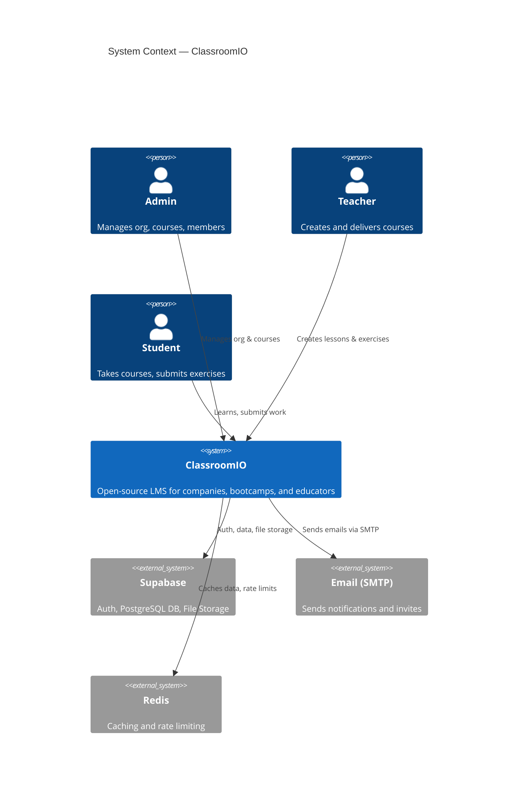

# L1 — System Context

```mermaid
C4Context
  title System Context — ClassroomIO

  Person(admin, "Admin", "Manages org, courses, members")
  Person(teacher, "Teacher", "Creates and delivers courses")
  Person(student, "Student", "Takes courses, submits exercises")

  System(classroomio, "ClassroomIO", "Open-source LMS for companies, bootcamps, and educators")

  System_Ext(supabase, "Supabase", "Auth, PostgreSQL DB, File Storage")
  System_Ext(email, "Email (SMTP)", "Sends notifications and invites")
  System_Ext(redis, "Redis", "Caching and rate limiting")

  Rel(admin, classroomio, "Manages org & courses")
  Rel(teacher, classroomio, "Creates lessons & exercises")
  Rel(student, classroomio, "Learns, submits work")
  Rel(classroomio, supabase, "Auth, data, file storage")
  Rel(classroomio, email, "Sends emails via SMTP")
  Rel(classroomio, redis, "Caches data, rate limits")

  UpdateLayoutConfig($c4ShapeInRow="3", $c4BoundaryInRow="1")
```
