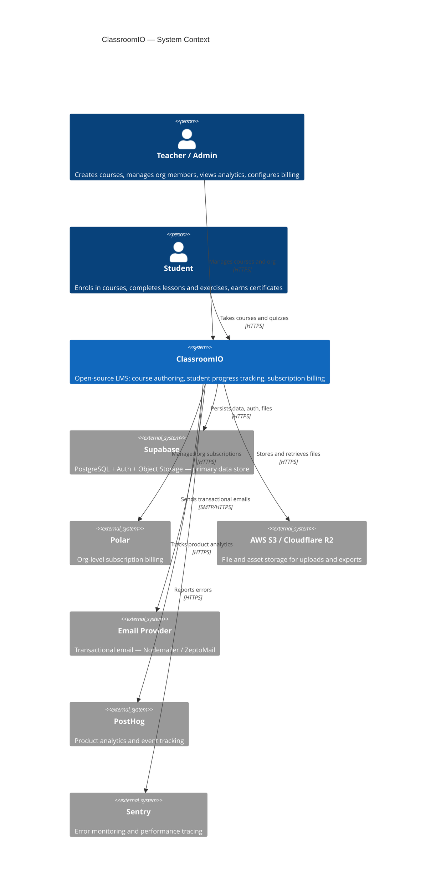

# Layer 1 — System Context

> Generated 2026-05-15. Describes ClassroomIO's place in the world.

```mermaid
C4Context
    title ClassroomIO — System Context

    Person(teacher, "Teacher / Admin", "Creates courses, manages org members, views analytics, configures billing")
    Person(student, "Student", "Enrols in courses, completes lessons and exercises, earns certificates")

    System(classroomio, "ClassroomIO", "Open-source LMS: course authoring, student progress tracking, subscription billing")

    System_Ext(supabase, "Supabase", "PostgreSQL + Auth + Object Storage — primary data store")
    System_Ext(polar, "Polar", "Org-level subscription billing")
    System_Ext(s3, "AWS S3 / Cloudflare R2", "File and asset storage for uploads and exports")
    System_Ext(email, "Email Provider", "Transactional email — Nodemailer / ZeptoMail")
    System_Ext(posthog, "PostHog", "Product analytics and event tracking")
    System_Ext(sentry, "Sentry", "Error monitoring and performance tracing")

    Rel(teacher, classroomio, "Manages courses and org", "HTTPS")
    Rel(student, classroomio, "Takes courses and quizzes", "HTTPS")
    Rel(classroomio, supabase, "Persists data, auth, files", "HTTPS")
    Rel(classroomio, polar, "Manages org subscriptions", "HTTPS")
    Rel(classroomio, s3, "Stores and retrieves files", "HTTPS")
    Rel(classroomio, email, "Sends transactional emails", "SMTP/HTTPS")
    Rel(classroomio, posthog, "Tracks product analytics", "HTTPS")
    Rel(classroomio, sentry, "Reports errors", "HTTPS")
```
