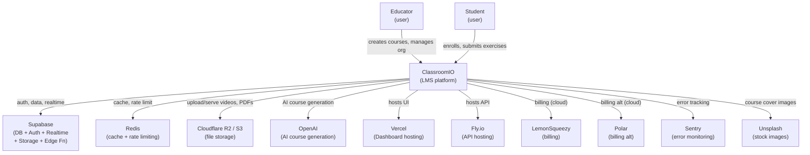

# L1 System Context
_Generated: 2026-03-13T08:23:26Z_

| System | Role |
|--------|------|
| Supabase | PostgreSQL + Auth + Realtime + Storage + Edge Functions |
| Redis | API-layer caching and rate limiting |
| Cloudflare R2 / S3 | Video and PDF file storage |
| OpenAI | AI-powered course generation (completions) |
| Vercel | Dashboard (SvelteKit) hosting and serverless functions |
| Fly.io | API (Hono/Node) hosting |
| LemonSqueezy | Subscription billing (cloud only) |
| Polar | Alternative billing provider (cloud only) |
| Sentry | Runtime error monitoring (Dashboard) |
| Unsplash | Stock photo API for course cover images |
