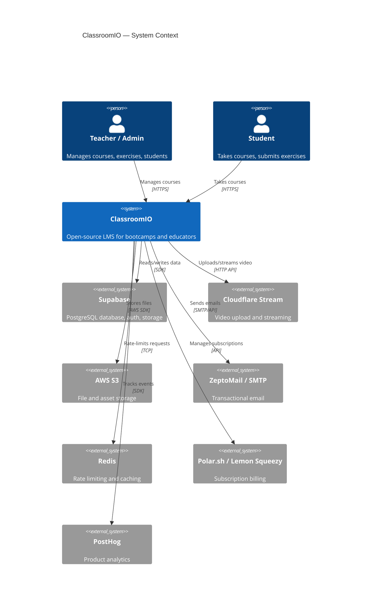

# C4 L1 — System Context

```mermaid
C4Context
  title ClassroomIO — System Context

  Person(teacher, "Teacher / Admin", "Manages courses, exercises, students")
  Person(student, "Student", "Takes courses, submits exercises")

  System(cio, "ClassroomIO", "Open-source LMS for bootcamps and educators")

  System_Ext(supabase, "Supabase", "PostgreSQL database, auth, storage")
  System_Ext(cloudflare, "Cloudflare Stream", "Video upload and streaming")
  System_Ext(s3, "AWS S3", "File and asset storage")
  System_Ext(email, "ZeptoMail / SMTP", "Transactional email")
  System_Ext(redis, "Redis", "Rate limiting and caching")
  System_Ext(billing, "Polar.sh / Lemon Squeezy", "Subscription billing")
  System_Ext(posthog, "PostHog", "Product analytics")

  Rel(teacher, cio, "Manages courses", "HTTPS")
  Rel(student, cio, "Takes courses", "HTTPS")
  Rel(cio, supabase, "Reads/writes data", "SDK")
  Rel(cio, cloudflare, "Uploads/streams video", "HTTP API")
  Rel(cio, s3, "Stores files", "AWS SDK")
  Rel(cio, email, "Sends emails", "SMTP/API")
  Rel(cio, redis, "Rate-limits requests", "TCP")
  Rel(cio, billing, "Manages subscriptions", "API")
  Rel(cio, posthog, "Tracks events", "SDK")
```
