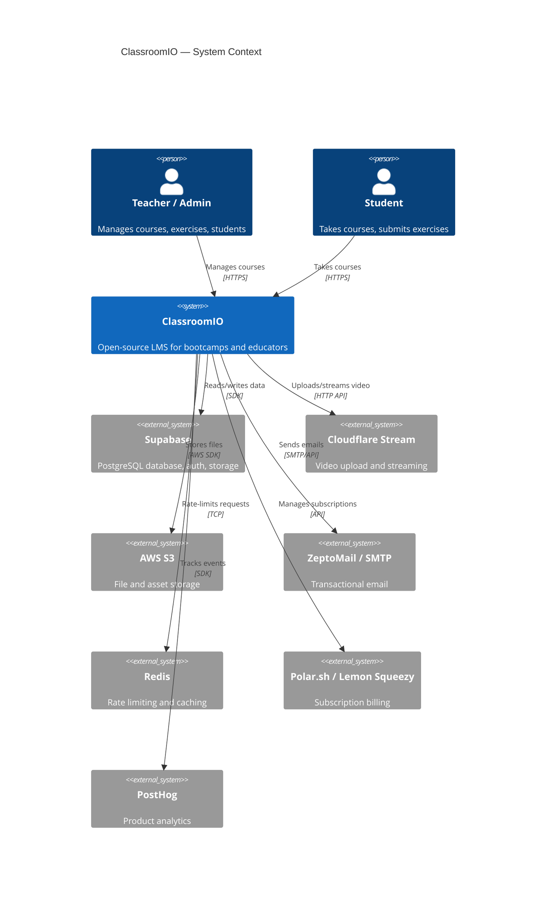

# C4 L1 — System Context

ClassroomIO sits between two types of users — **Teachers/Admins** who create and manage content, and **Students** who consume it. All persistent state lives in **Supabase** (PostgreSQL + Auth). The remaining external systems handle specialised concerns: video streaming (Cloudflare), file storage (S3), transactional email, rate-limiting (Redis), subscription billing, and product analytics.

This diagram treats ClassroomIO as a single black box. See [L2 Containers](l2-containers.md) to zoom into its internal structure.

## Elements

### Users

| Person | Role |
|--------|------|
| Teacher / Admin | Creates and manages courses, exercises, and students |
| Student | Enrols in courses, submits exercises, earns certificates |

### External Systems

| System | Purpose |
|--------|---------|
| Supabase | PostgreSQL database, row-level auth, and file storage |
| Cloudflare Stream | Video upload presigning and adaptive streaming |
| AWS S3 | Course asset and file storage |
| ZeptoMail / SMTP | Transactional email (invites, submissions, welcome) |
| Redis | API rate-limiting and caching |
| Polar.sh / Lemon Squeezy | Subscription billing and plan management |
| PostHog | Product analytics and event tracking |

## Diagram

```mermaid
C4Context
  title ClassroomIO — System Context

  Person(teacher, "Teacher / Admin", "Manages courses, exercises, students")
  Person(student, "Student", "Takes courses, submits exercises")

  System(cio, "ClassroomIO", "Open-source LMS for bootcamps and educators")

  System_Ext(supabase, "Supabase", "PostgreSQL database, auth, storage")
  System_Ext(cloudflare, "Cloudflare Stream", "Video upload and streaming")
  System_Ext(s3, "AWS S3", "File and asset storage")
  System_Ext(email, "ZeptoMail / SMTP", "Transactional email")
  System_Ext(redis, "Redis", "Rate limiting and caching")
  System_Ext(billing, "Polar.sh / Lemon Squeezy", "Subscription billing")
  System_Ext(posthog, "PostHog", "Product analytics")

  Rel(teacher, cio, "Manages courses", "HTTPS")
  Rel(student, cio, "Takes courses", "HTTPS")
  Rel(cio, supabase, "Reads/writes data", "SDK")
  Rel(cio, cloudflare, "Uploads/streams video", "HTTP API")
  Rel(cio, s3, "Stores files", "AWS SDK")
  Rel(cio, email, "Sends emails", "SMTP/API")
  Rel(cio, redis, "Rate-limits requests", "TCP")
  Rel(cio, billing, "Manages subscriptions", "API")
  Rel(cio, posthog, "Tracks events", "SDK")
```
