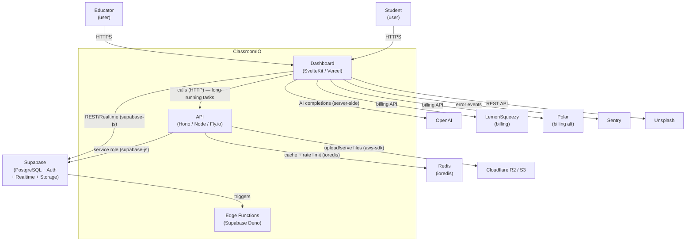

# L2 Containers
_Generated: 2026-03-13T08:23:26Z_

| Container | Tech | Responsibility |
|-----------|------|----------------|
| Dashboard | SvelteKit, Tailwind, Carbon DS, Vercel adapter | Main LMS UI — course management, student portal, org admin |
| API | Hono (Node.js), Fly.io | Long-running tasks: PDF/video processing, email, AI, file upload |
| Edge Functions | Supabase Deno | DB-triggered serverless logic (`notify` and related functions) |
| Supabase | PostgreSQL 15, GoTrue, Realtime | Primary data store, auth, real-time subscriptions, file storage |
| Redis | ioredis | API-layer caching and per-route rate limiting |
| Cloudflare R2 / S3 | AWS SDK v3 | Binary file storage (videos, PDFs, uploads) |

**Note:** Dashboard → API HTTP calls are not captured by static import analysis. These cross-container relationships are documented manually based on `lib/utils/services/api` and `routes/api/` proxy patterns.
