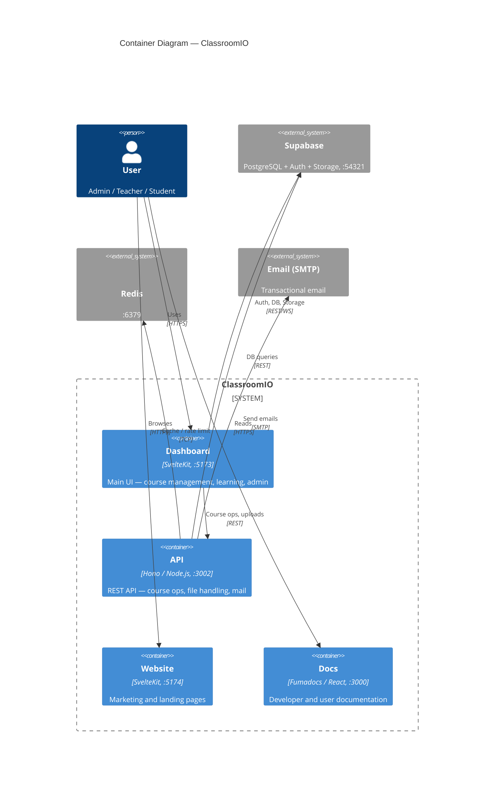

# L2 — Containers

```mermaid
C4Container
  title Container Diagram — ClassroomIO

  Person(user, "User", "Admin / Teacher / Student")

  System_Boundary(classroomio, "ClassroomIO") {
    Container(dashboard, "Dashboard", "SvelteKit, :5173", "Main UI — course management, learning, admin")
    Container(api, "API", "Hono / Node.js, :3002", "REST API — course ops, file handling, mail")
    Container(website, "Website", "SvelteKit, :5174", "Marketing and landing pages")
    Container(docs, "Docs", "Fumadocs / React, :3000", "Developer and user documentation")
  }

  System_Ext(supabase, "Supabase", "PostgreSQL + Auth + Storage, :54321")
  System_Ext(redis, "Redis", ":6379", "Caching and rate limiting")
  System_Ext(email, "Email (SMTP)", "Transactional email")

  Rel(user, dashboard, "Uses", "HTTPS")
  Rel(user, website, "Browses", "HTTPS")
  Rel(user, docs, "Reads", "HTTPS")
  Rel(dashboard, supabase, "Auth, DB, Storage", "REST/WS")
  Rel(dashboard, api, "Course ops, uploads", "REST")
  Rel(api, supabase, "DB queries", "REST")
  Rel(api, redis, "Cache / rate limit", "TCP")
  Rel(api, email, "Send emails", "SMTP")

  UpdateLayoutConfig($c4ShapeInRow="4", $c4BoundaryInRow="1")
```
