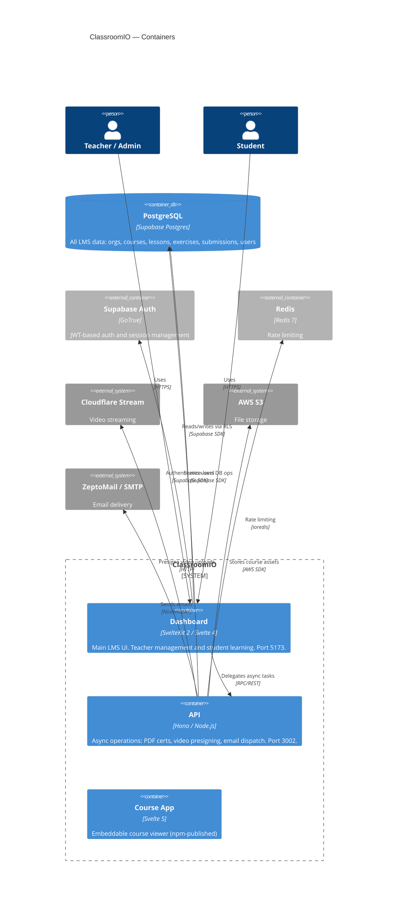

# C4 L2 — Containers

ClassroomIO is composed of three deployable containers. The **Dashboard** (SvelteKit, port 5173) is the primary UI for both teachers and students; it reads and writes directly to Supabase via Row-Level Security and delegates long-running work to the API. The **API** (Hono/Node.js, port 3002) handles async operations — PDF certificate generation, video upload presigning, and email dispatch — and is the only container that talks to Cloudflare, S3, and the mail server. The **Course App** is a standalone embeddable Svelte 5 component published to npm, independent of the other two.

Key architectural decision: the API does **not** own the database. Both the Dashboard and the API use the Supabase SDK; the difference is that the Dashboard operates under user-scoped RLS policies while the API uses the service-role key for privileged operations.

See [L3 Dashboard](l3-dashboard.md) and [L3 API](l3-api.md) for the internal component structure.

```mermaid
C4Container
  title ClassroomIO — Containers

  Person(teacher, "Teacher / Admin")
  Person(student, "Student")

  System_Boundary(cio, "ClassroomIO") {
    Container(dashboard, "Dashboard", "SvelteKit 2 / Svelte 4", "Main LMS UI. Teacher management and student learning. Port 5173.")
    Container(api, "API", "Hono / Node.js", "Async operations: PDF certs, video presigning, email dispatch. Port 3002.")
    Container(courseapp, "Course App", "Svelte 5", "Embeddable course viewer (npm-published)")
  }

  ContainerDb(db, "PostgreSQL", "Supabase Postgres", "All LMS data: orgs, courses, lessons, exercises, submissions, users")
  Container_Ext(auth, "Supabase Auth", "GoTrue", "JWT-based auth and session management")
  Container_Ext(redis, "Redis", "Redis 7", "Rate limiting")
  System_Ext(cloudflare, "Cloudflare Stream", "Video streaming")
  System_Ext(s3, "AWS S3", "File storage")
  System_Ext(email, "ZeptoMail / SMTP", "Email delivery")

  Rel(teacher, dashboard, "Uses", "HTTPS")
  Rel(student, dashboard, "Uses", "HTTPS")
  Rel(dashboard, db, "Reads/writes via RLS", "Supabase SDK")
  Rel(dashboard, auth, "Authenticates users", "Supabase SDK")
  Rel(dashboard, api, "Delegates async tasks", "RPC/REST")
  Rel(api, db, "Service-level DB ops", "Supabase SDK")
  Rel(api, redis, "Rate limiting", "ioredis")
  Rel(api, cloudflare, "Presigns video uploads", "HTTP")
  Rel(api, s3, "Stores course assets", "AWS SDK")
  Rel(api, email, "Sends emails", "Nodemailer")
```
