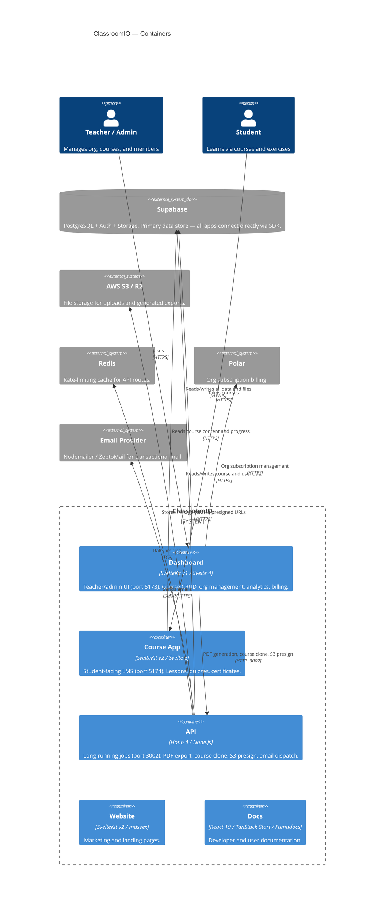

# Layer 2 — Containers

> Generated 2026-05-15. Shows deployable units inside ClassroomIO.

```mermaid
C4Container
    title ClassroomIO — Containers

    Person(teacher, "Teacher / Admin", "Manages org, courses, and members")
    Person(student, "Student", "Learns via courses and exercises")

    System_Boundary(classroomio, "ClassroomIO") {
        Container(dashboard, "Dashboard", "SvelteKit v1 / Svelte 4", "Teacher/admin UI (port 5173). Course CRUD, org management, analytics, billing.")
        Container(courseApp, "Course App", "SvelteKit v2 / Svelte 5", "Student-facing LMS (port 5174). Lessons, quizzes, certificates.")
        Container(api, "API", "Hono 4 / Node.js", "Long-running jobs (port 3002): PDF export, course clone, S3 presign, email dispatch.")
        Container(website, "Website", "SvelteKit v2 / mdsvex", "Marketing and landing pages.")
        Container(docs, "Docs", "React 19 / TanStack Start / Fumadocs", "Developer and user documentation.")
    }

    SystemDb_Ext(supabase, "Supabase", "PostgreSQL + Auth + Storage. Primary data store — all apps connect directly via SDK.")
    System_Ext(s3, "AWS S3 / R2", "File storage for uploads and generated exports.")
    System_Ext(redis, "Redis", "Rate-limiting cache for API routes.")
    System_Ext(polar, "Polar", "Org subscription billing.")
    System_Ext(emailSvc, "Email Provider", "Nodemailer / ZeptoMail for transactional mail.")

    Rel(teacher, dashboard, "Uses", "HTTPS")
    Rel(student, courseApp, "Takes courses", "HTTPS")
    Rel(dashboard, api, "PDF generation, course clone, S3 presign", "HTTP :3002")
    Rel(dashboard, supabase, "Reads/writes all data and files", "HTTPS")
    Rel(courseApp, supabase, "Reads course content and progress", "HTTPS")
    Rel(api, supabase, "Reads/writes course and user data", "HTTPS")
    Rel(api, s3, "Stores files, generates presigned URLs", "HTTPS")
    Rel(api, redis, "Rate-limiting", "TCP")
    Rel(api, emailSvc, "Sends emails", "SMTP/HTTPS")
    Rel(dashboard, polar, "Org subscription management", "HTTPS")
```
