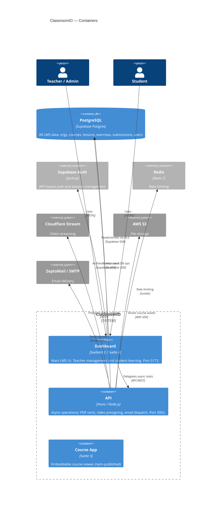

# C4 L2 — Containers

```mermaid
C4Container
  title ClassroomIO — Containers

  Person(teacher, "Teacher / Admin")
  Person(student, "Student")

  System_Boundary(cio, "ClassroomIO") {
    Container(dashboard, "Dashboard", "SvelteKit 2 / Svelte 4", "Main LMS UI. Teacher management and student learning. Port 5173.")
    Container(api, "API", "Hono / Node.js", "Async operations: PDF certs, video presigning, email dispatch. Port 3002.")
    Container(courseapp, "Course App", "Svelte 5", "Embeddable course viewer (npm-published)")
  }

  ContainerDb(db, "PostgreSQL", "Supabase Postgres", "All LMS data: orgs, courses, lessons, exercises, submissions, users")
  Container_Ext(auth, "Supabase Auth", "GoTrue", "JWT-based auth and session management")
  Container_Ext(redis, "Redis", "Redis 7", "Rate limiting")
  System_Ext(cloudflare, "Cloudflare Stream", "Video streaming")
  System_Ext(s3, "AWS S3", "File storage")
  System_Ext(email, "ZeptoMail / SMTP", "Email delivery")

  Rel(teacher, dashboard, "Uses", "HTTPS")
  Rel(student, dashboard, "Uses", "HTTPS")
  Rel(dashboard, db, "Reads/writes via RLS", "Supabase SDK")
  Rel(dashboard, auth, "Authenticates users", "Supabase SDK")
  Rel(dashboard, api, "Delegates async tasks", "RPC/REST")
  Rel(api, db, "Service-level DB ops", "Supabase SDK")
  Rel(api, redis, "Rate limiting", "ioredis")
  Rel(api, cloudflare, "Presigns video uploads", "HTTP")
  Rel(api, s3, "Stores course assets", "AWS SDK")
  Rel(api, email, "Sends emails", "Nodemailer")
```
