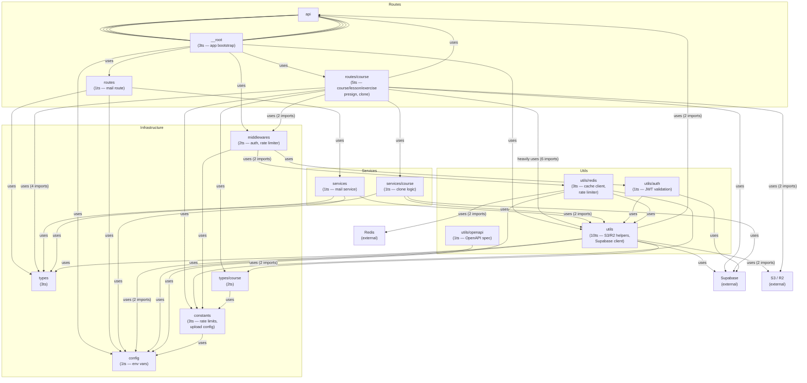

# L3 API Components
_Generated: 2026-03-13T08:23:26Z | componentDepth: 2 | Source files: 37 ts_
_AST-derived via ts-morph._

| Component | Responsibility |
|-----------|----------------|
| `__root` | Hono app setup, route registration, middleware application |
| `routes/course` | Course/lesson/exercise CRUD, file presigning, course clone |
| `routes` (mail) | Email send endpoint |
| `services/course` | Course clone business logic |
| `utils` | Supabase service-role client, Cloudflare R2/S3 upload helpers |
| `utils/auth` | JWT verification for API authentication |
| `utils/redis` | Redis client initialisation, rate-limiter helpers |
| `middlewares` | Auth guard and rate-limit middleware for Hono |
| `config` | Environment variable validation and export |
| `constants` | Rate limit rules, upload size/type constraints |
