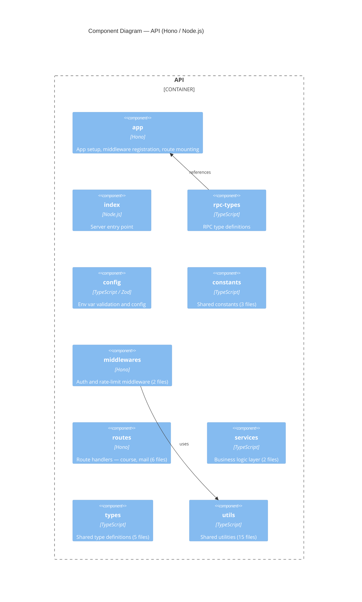

# L3 — API Components

> Derived from AST extraction (`docs/c4/components-api.json`, depth=1, 2026-03-13).

```mermaid
C4Component
  title Component Diagram — API (Hono / Node.js)

  Container_Boundary(api, "API") {
    Component(app, "app", "Hono", "App setup, middleware registration, route mounting")
    Component(index, "index", "Node.js", "Server entry point")
    Component(rpc_types, "rpc-types", "TypeScript", "RPC type definitions")
    Component(config, "config", "TypeScript / Zod", "Env var validation and config")
    Component(constants, "constants", "TypeScript", "Shared constants (3 files)")
    Component(middlewares, "middlewares", "Hono", "Auth and rate-limit middleware (2 files)")
    Component(routes, "routes", "Hono", "Route handlers — course, mail (6 files)")
    Component(services, "services", "TypeScript", "Business logic layer (2 files)")
    Component(types, "types", "TypeScript", "Shared type definitions (5 files)")
    Component(utils, "utils", "TypeScript", "Shared utilities (15 files)")
  }

  Rel(rpc_types, app, "references")
  Rel(middlewares, utils, "uses")

  UpdateLayoutConfig($c4ShapeInRow="5", $c4BoundaryInRow="1")
```
