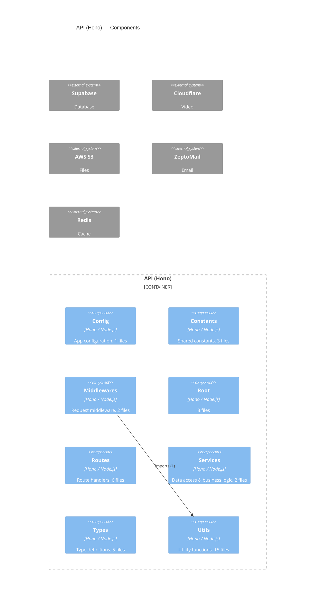

# C4 L3 — API (Hono) Components

```mermaid
C4Component
  title API (Hono) — Components

  System_Ext(supabase, "Supabase", "Database")
  System_Ext(cloudflare, "Cloudflare", "Video")
  System_Ext(s3, "AWS S3", "Files")
  System_Ext(email, "ZeptoMail", "Email")
  System_Ext(redis, "Redis", "Cache")

  Container_Boundary(api_bound, "API (Hono)") {
    Component(api_config, "Config", "Hono / Node.js", "App configuration. 1 files")
    Component(api_constants, "Constants", "Hono / Node.js", "Shared constants. 3 files")
    Component(api_middlewares, "Middlewares", "Hono / Node.js", "Request middleware. 2 files")
    Component(api_root, "Root", "Hono / Node.js", "3 files")
    Component(api_routes, "Routes", "Hono / Node.js", "Route handlers. 6 files")
    Component(api_services, "Services", "Hono / Node.js", "Data access & business logic. 2 files")
    Component(api_types, "Types", "Hono / Node.js", "Type definitions. 5 files")
    Component(api_utils, "Utils", "Hono / Node.js", "Utility functions. 15 files")
  }

  Rel(api_middlewares, api_utils, "imports (1)")
```
