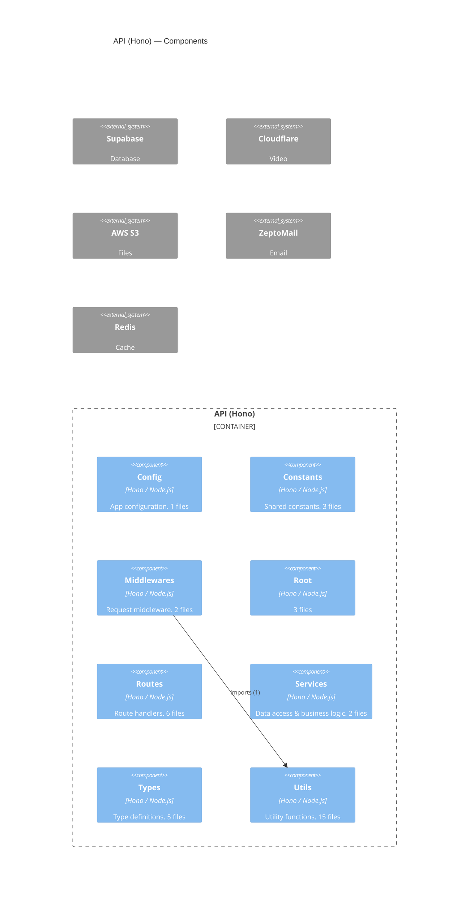

# C4 L3 — API (Hono) Components

Components are grouped at depth 1 (one level below `src/`). Relationship arrows show TypeScript import edges.

The API follows a standard layered structure: **routes** (Hono handlers), **services** (Supabase queries and business logic), **utils** (shared helpers, mail, certificate generation), **types** (Zod schemas and TypeScript types), **middlewares** (rate-limiter, auth validation), and **config** (environment setup). Low internal coupling is intentional — the only detected import edge is middlewares → utils.

Regenerate with `/c4-model` after adding new routes or services.

## Components

### Route Handlers (`routes/`)

| Path | Files | Description |
|------|-------|-------------|
| `routes` | 6 ts | Route handlers |

### Services

| Path | Files | Description |
|------|-------|-------------|
| `services` | 2 ts | Data access & business logic |

### Utils

| Path | Files | Description |
|------|-------|-------------|
| `utils` | 15 ts | Utility functions |

### Types

| Path | Files | Description |
|------|-------|-------------|
| `types` | 5 ts | Type definitions |

### Middleware

| Path | Files | Description |
|------|-------|-------------|
| `middlewares` | 2 ts | Request middleware |

### Other

| Path | Files | Description |
|------|-------|-------------|
| `config` | 1 ts | App configuration |
| `constants` | 3 ts | Shared constants |
| `root` | 3 ts | — |

## Diagram

```mermaid
C4Component
  title API (Hono) — Components

  System_Ext(supabase, "Supabase", "Database")
  System_Ext(cloudflare, "Cloudflare", "Video")
  System_Ext(s3, "AWS S3", "Files")
  System_Ext(email, "ZeptoMail", "Email")
  System_Ext(redis, "Redis", "Cache")

  Container_Boundary(api_bound, "API (Hono)") {
    Component(api_config, "Config", "Hono / Node.js", "App configuration. 1 files")
    Component(api_constants, "Constants", "Hono / Node.js", "Shared constants. 3 files")
    Component(api_middlewares, "Middlewares", "Hono / Node.js", "Request middleware. 2 files")
    Component(api_root, "Root", "Hono / Node.js", "3 files")
    Component(api_routes, "Routes", "Hono / Node.js", "Route handlers. 6 files")
    Component(api_services, "Services", "Hono / Node.js", "Data access & business logic. 2 files")
    Component(api_types, "Types", "Hono / Node.js", "Type definitions. 5 files")
    Component(api_utils, "Utils", "Hono / Node.js", "Utility functions. 15 files")
  }

  Rel(api_middlewares, api_utils, "imports (1)")
```
