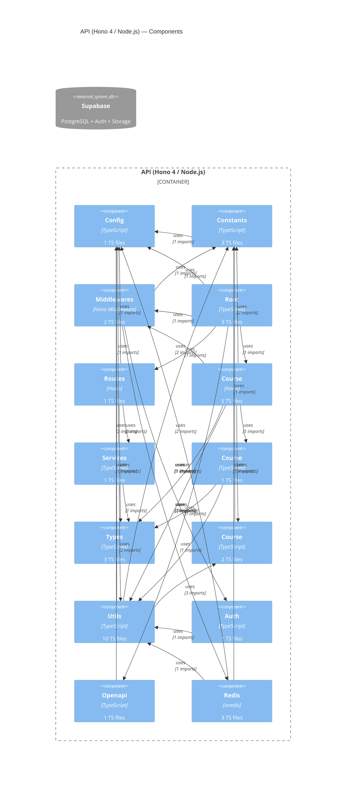

# Layer 3 — API Components

> Generated 2026-05-15 from AST. 14 components, 32 relationships. Component depth: 2. Total source files: 37 TS + 0 Svelte.

```mermaid
C4Component
    title API (Hono 4 / Node.js) — Components

    Container_Boundary(api_boundary, "API (Hono 4 / Node.js)") {
        Component(config, "Config", "TypeScript", "1 TS files")
        Component(constants, "Constants", "TypeScript", "3 TS files")
        Component(middlewares, "Middlewares", "Hono Middleware", "2 TS files")
        Component(root, "Root", "TypeScript", "3 TS files")
        Component(routes, "Routes", "Hono", "1 TS files")
        Component(routes_course, "Course", "Hono", "5 TS files")
        Component(services, "Services", "TypeScript", "1 TS files")
        Component(services_course, "Course", "TypeScript", "1 TS files")
        Component(types, "Types", "TypeScript", "3 TS files")
        Component(types_course, "Course", "TypeScript", "2 TS files")
        Component(utils, "Utils", "TypeScript", "10 TS files")
        Component(utils_auth, "Auth", "TypeScript", "1 TS files")
        Component(utils_openapi, "Openapi", "TypeScript", "1 TS files")
        Component(utils_redis, "Redis", "ioredis", "3 TS files")
    }

    SystemDb_Ext(supabase_ext, "Supabase", "PostgreSQL + Auth + Storage")

    Rel(routes_course, utils, "uses", "6 imports")
    Rel(routes_course, types_course, "uses", "4 imports")
    Rel(utils, types_course, "uses", "3 imports")
    Rel(middlewares, utils_redis, "uses", "2 imports")
    Rel(services, utils, "uses", "2 imports")
    Rel(utils, constants, "uses", "2 imports")
    Rel(utils, config, "uses", "2 imports")
    Rel(routes_course, middlewares, "uses", "2 imports")
    Rel(routes_course, constants, "uses", "2 imports")
    Rel(root, routes_course, "uses", "1 imports")
    Rel(root, routes, "uses", "1 imports")
    Rel(root, middlewares, "uses", "1 imports")
    Rel(root, utils_openapi, "uses", "1 imports")
    Rel(root, config, "uses", "1 imports")
    Rel(constants, config, "uses", "1 imports")
    Rel(middlewares, utils_auth, "uses", "1 imports")
    Rel(middlewares, constants, "uses", "1 imports")
    Rel(routes, services, "uses", "1 imports")
    Rel(routes, types, "uses", "1 imports")
    Rel(routes, config, "uses", "1 imports")
    Rel(services, types, "uses", "1 imports")
    Rel(services, config, "uses", "1 imports")
    Rel(routes_course, services_course, "uses", "1 imports")
    Rel(routes_course, types, "uses", "1 imports")
    Rel(services_course, utils, "uses", "1 imports")
    Rel(services_course, types, "uses", "1 imports")
    Rel(types_course, constants, "uses", "1 imports")
    Rel(utils_auth, utils, "uses", "1 imports")
    Rel(utils_openapi, config, "uses", "1 imports")
    Rel(utils_redis, utils, "uses", "1 imports")
    Rel(utils_redis, constants, "uses", "1 imports")
    Rel(utils_redis, config, "uses", "1 imports")
```
