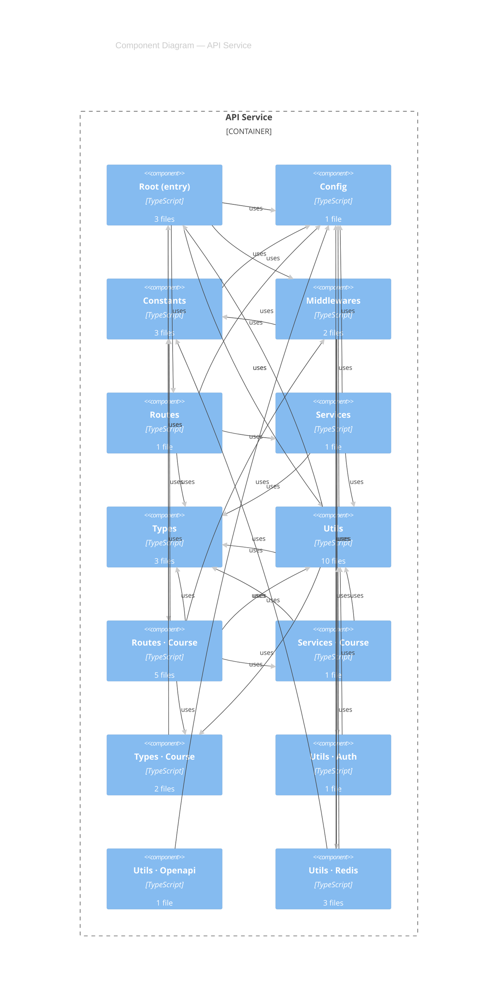

<!-- Generated by c4-original-dark skill — do not edit manually -->

```mermaid
%%{init: {'theme': 'dark'}}%%
C4Component
  title Component Diagram — API Service

  Container_Boundary(apiCtr, "API Service", "Hono 4 · Node.js · TypeScript") {
    Component(root, "Root (entry)", "TypeScript", "3 files")
    Component(config, "Config", "TypeScript", "1 file")
    Component(constants, "Constants", "TypeScript", "3 files")
    Component(middlewares, "Middlewares", "TypeScript", "2 files")
    Component(routes, "Routes", "TypeScript", "1 file")
    Component(services, "Services", "TypeScript", "1 file")
    Component(types, "Types", "TypeScript", "3 files")
    Component(utils, "Utils", "TypeScript", "10 files")
    Component(routes_course, "Routes · Course", "TypeScript", "5 files")
    Component(services_course, "Services · Course", "TypeScript", "1 file")
    Component(types_course, "Types · Course", "TypeScript", "2 files")
    Component(utils_auth, "Utils · Auth", "TypeScript", "1 file")
    Component(utils_openapi, "Utils · Openapi", "TypeScript", "1 file")
    Component(utils_redis, "Utils · Redis", "TypeScript", "3 files")
  }

  Rel(root, config, "uses")
  Rel(root, middlewares, "uses")
  Rel(root, routes, "uses")
  Rel(root, routes_course, "uses")
  Rel(root, utils, "uses")
  Rel(constants, config, "uses")
  Rel(middlewares, constants, "uses")
  Rel(middlewares, utils_auth, "uses")
  Rel(middlewares, utils_redis, "uses")
  Rel(routes, config, "uses")
  Rel(routes, services, "uses")
  Rel(routes, types, "uses")
  Rel(services, config, "uses")
  Rel(services, types, "uses")
  Rel(services, utils, "uses")
  Rel(utils, root, "uses")
  Rel(utils, config, "uses")
  Rel(utils, types, "uses")
  Rel(utils, types_course, "uses")
  Rel(routes_course, root, "uses")
  Rel(routes_course, constants, "uses")
  Rel(routes_course, middlewares, "uses")
  Rel(routes_course, services_course, "uses")
  Rel(routes_course, types, "uses")
  Rel(routes_course, types_course, "uses")
  Rel(routes_course, utils, "uses")
  Rel(services_course, types, "uses")
  Rel(services_course, utils, "uses")
  Rel(types_course, constants, "uses")
  Rel(utils_auth, utils, "uses")
  Rel(utils_openapi, config, "uses")
  Rel(utils_redis, config, "uses")
  Rel(utils_redis, constants, "uses")
  Rel(utils_redis, utils, "uses")
```
