# L3 — Dashboard Components

> Derived from AST extraction (`docs/c4/components-dashboard.json`, depth=3, 2026-03-13).
> Leaf components with no relationships omitted (`lib/mocks/*`, standalone pages, ambient types).

```mermaid
C4Component
  title Component Diagram — Dashboard (SvelteKit)

  Container_Boundary(dashboard, "Dashboard") {
    Component(hooks_server_ts, "hooks.server", "SvelteKit Hook", "Auth and locale server hook")
    Component(lib_config_ts, "lib/config", "TypeScript", "App configuration and env vars")
    Component(mail_sendEmail_ts, "mail/sendEmail", "TypeScript", "Email sending helper")

    Component(lib_utils_functions, "lib/utils/functions", "TypeScript", "Core utility functions — auth, data transforms (52 files)")
    Component(lib_utils_services, "lib/utils/services", "TypeScript", "Supabase data access layer (21 files)")
    Component(lib_utils_store, "lib/utils/store", "Svelte Store", "Reactive application state (5 files)")
    Component(lib_utils_constants, "lib/utils/constants", "TypeScript", "Shared constants (9 files)")
    Component(lib_utils_types, "lib/utils/types", "TypeScript", "Shared type definitions (9 files)")

    Component(lib_components_Course, "lib/components/Course", "Svelte/TS", "Course management UI (23 ts + 91 svelte files)")
    Component(lib_components_Apps, "lib/components/Apps", "Svelte/TS", "Mini-apps — Poll, Quiz (6 ts + 9 svelte files)")
    Component(lib_components_Courses, "lib/components/Courses", "Svelte/TS", "Course listing UI")
    Component(lib_components_CourseLandingPage, "lib/components/CourseLandingPage", "Svelte/TS", "Public course landing page")
    Component(lib_components_Question, "lib/components/Question", "Svelte/TS", "Question and answer UI")
    Component(lib_components_Snackbar, "lib/components/Snackbar", "Svelte/TS", "Notification toasts")
    Component(lib_components_UploadWidget, "lib/components/UploadWidget", "Svelte/TS", "File upload widget")
    Component(lib_components_Confetti, "lib/components/Confetti", "Svelte/TS", "Celebration animation")

    Component(routes_layout_server_ts, "routes/+layout.server", "SvelteKit", "Root server layout — auth, locale")
    Component(routes_layout_ts, "routes/+layout", "SvelteKit", "Root client layout — store init")
    Component(routes_api_courses, "routes/api/courses", "SvelteKit API", "Courses API endpoints (7 files)")
    Component(routes_api_email, "routes/api/email", "SvelteKit API", "Email API endpoints (11 files)")
    Component(routes_api_analytics, "routes/api/analytics", "SvelteKit API", "Analytics API endpoints")
    Component(routes_api_admin, "routes/api/admin", "SvelteKit API", "Admin API endpoints")
    Component(routes_api_org, "routes/api/org", "SvelteKit API", "Organisation API endpoints")
    Component(routes_api_polar, "routes/api/polar", "SvelteKit API", "Billing (Polar) API endpoints")
    Component(routes_api_verify, "routes/api/verify", "SvelteKit API", "Email verification endpoint")
    Component(routes_api_domain, "routes/api/domain", "SvelteKit API", "Custom domain endpoint")
    Component(routes_course_slug, "routes/course/[slug]", "SvelteKit", "Course public page")
    Component(routes_org_slug, "routes/org/[slug]", "SvelteKit", "Organisation page")
    Component(routes_invite_s, "routes/invite/s", "SvelteKit", "Student invite handler")
    Component(routes_invite_t, "routes/invite/t", "SvelteKit", "Teacher invite handler")
  }

  %% hooks & mail
  Rel(hooks_server_ts, lib_utils_services, "uses")
  Rel(mail_sendEmail_ts, lib_utils_services, "uses")

  %% config
  Rel(lib_config_ts, lib_utils_types, "uses")

  %% layouts
  Rel(routes_layout_server_ts, lib_utils_functions, "uses")
  Rel(routes_layout_server_ts, lib_utils_types, "uses")
  Rel(routes_layout_server_ts, lib_utils_constants, "uses")
  Rel(routes_layout_server_ts, lib_utils_services, "uses")
  Rel(routes_layout_ts, lib_utils_functions, "uses")
  Rel(routes_layout_ts, lib_utils_store, "uses")

  %% utils internal
  Rel(lib_utils_functions, lib_utils_store, "uses")
  Rel(lib_utils_functions, lib_utils_services, "uses")
  Rel(lib_utils_functions, lib_utils_constants, "uses")
  Rel(lib_utils_functions, lib_utils_types, "uses")
  Rel(lib_utils_functions, lib_config_ts, "reads config")
  Rel(lib_utils_functions, lib_components_Course, "uses")
  Rel(lib_utils_services, lib_utils_functions, "uses")
  Rel(lib_utils_services, lib_utils_types, "uses")
  Rel(lib_utils_services, lib_utils_constants, "uses")
  Rel(lib_utils_services, lib_utils_store, "uses")
  Rel(lib_utils_services, lib_components_Question, "uses")
  Rel(lib_utils_services, lib_components_Course, "uses")
  Rel(lib_utils_store, lib_utils_types, "uses")
  Rel(lib_utils_store, lib_utils_constants, "uses")
  Rel(lib_utils_constants, lib_utils_types, "uses")

  %% components
  Rel(lib_components_Course, lib_utils_functions, "uses")
  Rel(lib_components_Course, lib_utils_types, "uses")
  Rel(lib_components_Course, lib_utils_constants, "uses")
  Rel(lib_components_Course, lib_utils_services, "uses")
  Rel(lib_components_Course, lib_components_Question, "uses")
  Rel(lib_components_Course, lib_components_Confetti, "uses")
  Rel(lib_components_Course, lib_components_Snackbar, "uses")
  Rel(lib_components_Apps, lib_utils_functions, "uses")
  Rel(lib_components_Apps, lib_components_Snackbar, "uses")
  Rel(lib_components_Courses, lib_utils_functions, "uses")
  Rel(lib_components_Courses, lib_utils_types, "uses")
  Rel(lib_components_CourseLandingPage, lib_utils_types, "uses")
  Rel(lib_components_UploadWidget, lib_utils_functions, "uses")

  %% API routes
  Rel(routes_api_courses, lib_utils_functions, "uses")
  Rel(routes_api_courses, lib_utils_types, "uses")
  Rel(routes_api_courses, lib_utils_services, "uses")
  Rel(routes_api_courses, lib_utils_constants, "uses")
  Rel(routes_api_email, mail_sendEmail_ts, "sends email via")
  Rel(routes_api_email, lib_utils_functions, "uses")
  Rel(routes_api_email, lib_utils_services, "uses")
  Rel(routes_api_analytics, lib_utils_functions, "uses")
  Rel(routes_api_analytics, lib_utils_types, "uses")
  Rel(routes_api_analytics, lib_utils_services, "uses")
  Rel(routes_api_admin, lib_utils_functions, "uses")
  Rel(routes_api_org, lib_utils_functions, "uses")
  Rel(routes_api_org, lib_utils_constants, "uses")
  Rel(routes_api_polar, lib_utils_functions, "uses")
  Rel(routes_api_polar, lib_utils_services, "uses")
  Rel(routes_api_polar, lib_utils_types, "uses")
  Rel(routes_api_verify, lib_utils_functions, "uses")
  Rel(routes_api_domain, lib_utils_services, "uses")

  %% page routes
  Rel(routes_course_slug, lib_utils_functions, "uses")
  Rel(routes_course_slug, lib_utils_services, "uses")
  Rel(routes_org_slug, lib_utils_functions, "uses")
  Rel(routes_invite_s, lib_utils_functions, "uses")
  Rel(routes_invite_s, lib_utils_services, "uses")
  Rel(routes_invite_t, lib_utils_functions, "uses")
  Rel(routes_invite_t, lib_utils_services, "uses")

  UpdateLayoutConfig($c4ShapeInRow="5", $c4BoundaryInRow="1")
```

