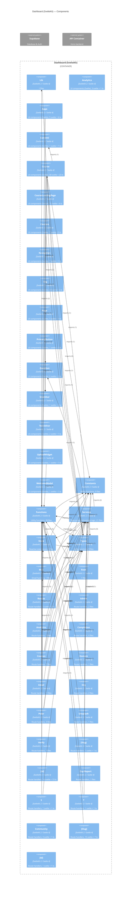

# C4 L3 — Dashboard (SvelteKit) Components

Components are grouped from the source tree at depth 2 (e.g. `lib/components`, `lib/utils`, `routes/api`). Relationship arrows show TypeScript import edges between groups; the number is the count of distinct imports.

**`lib/utils`** is the architectural hub — route handlers and UI components all funnel through it. It packages utility functions, Supabase data-access services, Svelte stores, shared types, and constants. **`routes/api/*`** are SvelteKit `+server.ts` endpoints (server-side API handlers). All other `routes/*` sub-directories map directly to browser URL paths.

Regenerate with `/c4-model` after adding routes or refactoring `lib/`.

```mermaid
C4Component
  title Dashboard (SvelteKit) — Components

  System_Ext(supabase, "Supabase", "Database & Auth")
  System_Ext(hono_api, "API Container", "Hono backend")

  Container_Boundary(dashboard_bound, "Dashboard (SvelteKit)") {
    Component(das_lib, "Lib", "SvelteKit 2 / Svelte 4", "1 files")
    Component(das_lib_components_Analytics, "Analytics", "SvelteKit 2 / Svelte 4", "UI components (Svelte). 3 svelte + 1 ts")
    Component(das_lib_components_Apps, "Apps", "SvelteKit 2 / Svelte 4", "UI components (Svelte). 9 svelte + 6 ts")
    Component(das_lib_components_Confetti, "Confetti", "SvelteKit 2 / Svelte 4", "UI components (Svelte). 1 svelte + 1 ts")
    Component(das_lib_components_Course, "Course", "SvelteKit 2 / Svelte 4", "UI components (Svelte). 68 svelte + 23 ts")
    Component(das_lib_components_CourseLandingPage, "CourseLandingPage", "SvelteKit 2 / Svelte 4", "UI components (Svelte). 15 svelte + 4 ts")
    Component(das_lib_components_Courses, "Courses", "SvelteKit 2 / Svelte 4", "UI components (Svelte). 7 svelte + 3 ts")
    Component(das_lib_components_Navigation, "Navigation", "SvelteKit 2 / Svelte 4", "UI components (Svelte). 7 svelte + 1 ts")
    Component(das_lib_components_Org, "Org", "SvelteKit 2 / Svelte 4", "UI components (Svelte). 44 svelte + 2 ts")
    Component(das_lib_components_Page, "Page", "SvelteKit 2 / Svelte 4", "UI components (Svelte). 5 svelte + 1 ts")
    Component(das_lib_components_PrimaryButton, "PrimaryButton", "SvelteKit 2 / Svelte 4", "UI components (Svelte). 1 svelte + 1 ts")
    Component(das_lib_components_Question, "Question", "SvelteKit 2 / Svelte 4", "UI components (Svelte). 6 svelte + 1 ts")
    Component(das_lib_components_Snackbar, "Snackbar", "SvelteKit 2 / Svelte 4", "UI components (Svelte). 1 svelte + 2 ts")
    Component(das_lib_components_TextEditor, "TextEditor", "SvelteKit 2 / Svelte 4", "UI components (Svelte). 2 svelte + 1 ts")
    Component(das_lib_components_UploadWidget, "UploadWidget", "SvelteKit 2 / Svelte 4", "UI components (Svelte). 1 svelte + 1 ts")
    Component(das_lib_components_WelcomeModal, "WelcomeModal", "SvelteKit 2 / Svelte 4", "UI components (Svelte). 1 svelte + 1 ts")
    Component(das_lib_utils_constants, "Constants", "SvelteKit 2 / Svelte 4", "Utility functions. 9 files")
    Component(das_lib_utils_functions, "Functions", "SvelteKit 2 / Svelte 4", "Utility functions. 38 files")
    Component(das_lib_utils_services, "Services", "SvelteKit 2 / Svelte 4", "Data access & business logic. 21 files")
    Component(das_lib_utils_store, "Store", "SvelteKit 2 / Svelte 4", "Reactive state stores. 5 files")
    Component(das_lib_utils_types, "Types", "SvelteKit 2 / Svelte 4", "Utility functions. 9 files")
    Component(das_mail, "Mail", "SvelteKit 2 / Svelte 4", "Email handling. 1 files")
    Component(das_root, "Root", "SvelteKit 2 / Svelte 4", "1 files")
    Component(das_routes, "Routes", "SvelteKit 2 / Svelte 4", "Route handlers. 3 svelte + 2 ts")
    Component(das_routes_api_admin, "Admin", "SvelteKit 2 / Svelte 4", "Route handlers. 2 files")
    Component(das_routes_api_analytics, "Analytics", "SvelteKit 2 / Svelte 4", "Route handlers. 2 files")
    Component(das_routes_api_completion, "Completion", "SvelteKit 2 / Svelte 4", "Route handlers. 4 files")
    Component(das_routes_api_courses, "Courses", "SvelteKit 2 / Svelte 4", "Route handlers. 7 files")
    Component(das_routes_api_domain, "Domain", "SvelteKit 2 / Svelte 4", "Route handlers. 1 files")
    Component(das_routes_api_email, "Email", "SvelteKit 2 / Svelte 4", "Route handlers. 11 files")
    Component(das_routes_api_org, "Org", "SvelteKit 2 / Svelte 4", "Route handlers. 2 files")
    Component(das_routes_api_polar, "Polar", "SvelteKit 2 / Svelte 4", "Route handlers. 3 files")
    Component(das_routes_api_unsplash, "Unsplash", "SvelteKit 2 / Svelte 4", "Route handlers. 1 files")
    Component(das_routes_api_verify, "Verify", "SvelteKit 2 / Svelte 4", "Route handlers. 1 files")
    Component(das_routes_course_slug_, "[Slug]", "SvelteKit 2 / Svelte 4", "Route handlers. 1 svelte + 1 ts")
    Component(das_routes_courses_id_, "[Id]", "SvelteKit 2 / Svelte 4", "Route handlers. 14 svelte + 13 ts")
    Component(das_routes_csp_report, "Csp Report", "SvelteKit 2 / Svelte 4", "Route handlers. 1 files")
    Component(das_routes_invite_s, "S", "SvelteKit 2 / Svelte 4", "Route handlers. 1 svelte + 1 ts")
    Component(das_routes_invite_t, "T", "SvelteKit 2 / Svelte 4", "Route handlers. 1 svelte + 1 ts")
    Component(das_routes_lms_community, "Community", "SvelteKit 2 / Svelte 4", "Route handlers. 3 svelte + 1 ts")
    Component(das_routes_org_slug_, "[Slug]", "SvelteKit 2 / Svelte 4", "Route handlers. 15 svelte + 7 ts")
    Component(das_routes_profile_id_, "[Id]", "SvelteKit 2 / Svelte 4", "Route handlers. 1 svelte + 1 ts")
  }

  Rel(das_routes_api_courses, das_lib_utils_functions, "imports (15)")
  Rel(das_lib_utils_services, das_lib_utils_functions, "imports (12)")
  Rel(das_routes_api_email, das_mail, "imports (11)")
  Rel(das_lib_components_Course, das_lib_utils_types, "imports (9)")
  Rel(das_lib_utils_services, das_lib_utils_types, "imports (9)")
  Rel(das_lib_utils_functions, das_lib_utils_constants, "imports (4)")
  Rel(das_lib_utils_functions, das_lib_utils_store, "imports (3)")
  Rel(das_lib_utils_functions, das_lib_utils_types, "imports (3)")
  Rel(das_lib_utils_store, das_lib_utils_types, "imports (3)")
  Rel(das_lib_utils_services, das_lib_utils_store, "imports (3)")
  Rel(das_routes_api_analytics, das_lib_utils_functions, "imports (3)")
  Rel(das_lib_components_Course, das_lib_utils_functions, "imports (3)")
  Rel(das_routes, das_lib_utils_functions, "imports (2)")
  Rel(das_lib_utils_functions, das_lib, "imports (2)")
  Rel(das_lib_utils_store, das_lib_utils_constants, "imports (2)")
  Rel(das_lib_utils_services, das_lib_utils_constants, "imports (2)")
  Rel(das_routes_api_admin, das_lib_utils_functions, "imports (2)")
  Rel(das_routes_api_analytics, das_lib_utils_types, "imports (2)")
  Rel(das_routes_api_courses, das_lib_utils_types, "imports (2)")
  Rel(das_routes_api_email, das_lib_utils_functions, "imports (2)")
  Rel(das_routes_api_org, das_lib_utils_functions, "imports (2)")
  Rel(das_routes_invite_t, das_lib_utils_functions, "imports (2)")
  Rel(das_lib_components_Course, das_lib_components_Question, "imports (2)")
  Rel(das_root, das_lib_utils_services, "imports (1)")
  Rel(das_lib, das_lib_utils_types, "imports (1)")
  Rel(das_mail, das_lib_utils_services, "imports (1)")
  Rel(das_routes, das_lib_utils_types, "imports (1)")
  Rel(das_routes, das_lib_utils_constants, "imports (1)")
  Rel(das_routes, das_lib_utils_services, "imports (1)")
  Rel(das_routes, das_lib_utils_store, "imports (1)")
  Rel(das_lib_components_Course, das_lib_utils_constants, "imports (1)")
  Rel(das_lib_components_CourseLandingPage, das_lib_utils_types, "imports (1)")
  Rel(das_lib_components_Courses, das_lib_utils_functions, "imports (1)")
  Rel(das_lib_components_Courses, das_lib_utils_types, "imports (1)")
  Rel(das_lib_components_UploadWidget, das_lib_utils_functions, "imports (1)")
  Rel(das_lib_utils_constants, das_lib_utils_types, "imports (1)")
  Rel(das_routes_api_domain, das_lib_utils_services, "imports (1)")
  Rel(das_routes_api_verify, das_lib_utils_functions, "imports (1)")
  Rel(das_routes_course_slug_, das_lib_utils_services, "imports (1)")
  Rel(das_routes_course_slug_, das_lib_utils_functions, "imports (1)")
  Rel(das_lib_utils_services, das_lib_components_Question, "imports (1)")
  Rel(das_lib_utils_services, das_lib_components_Course, "imports (1)")
  Rel(das_routes_api_analytics, das_lib_utils_services, "imports (1)")
  Rel(das_routes_api_courses, das_lib_utils_services, "imports (1)")
  Rel(das_routes_api_courses, das_lib_utils_constants, "imports (1)")
  Rel(das_routes_api_org, das_lib_utils_constants, "imports (1)")
  Rel(das_routes_api_polar, das_lib_utils_functions, "imports (1)")
  Rel(das_routes_api_polar, das_lib_utils_services, "imports (1)")
  Rel(das_routes_api_polar, das_lib_utils_types, "imports (1)")
  Rel(das_routes_invite_s, das_lib_utils_functions, "imports (1)")
  Rel(das_routes_invite_s, das_lib_utils_services, "imports (1)")
  Rel(das_routes_invite_t, das_lib_utils_services, "imports (1)")
  Rel(das_routes_org_slug_, das_lib_utils_functions, "imports (1)")
  Rel(das_lib_components_Apps, das_lib_components_Snackbar, "imports (1)")
  Rel(das_lib_components_Apps, das_lib_utils_functions, "imports (1)")
  Rel(das_routes_api_email, das_lib_utils_services, "imports (1)")
  Rel(das_lib_components_Course, das_lib_components_Confetti, "imports (1)")
  Rel(das_lib_components_Course, das_lib_components_Snackbar, "imports (1)")
```
