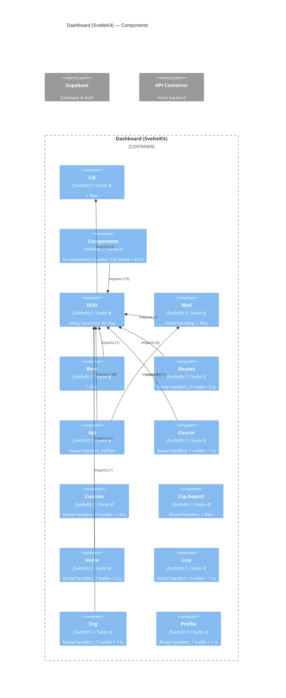

# C4 L3 — Dashboard (SvelteKit) Components

```mermaid
C4Component
  title Dashboard (SvelteKit) — Components

  System_Ext(supabase, "Supabase", "Database & Auth")
  System_Ext(hono_api, "API Container", "Hono backend")

  Container_Boundary(dashboard_bound, "Dashboard (SvelteKit)") {
    Component(das_lib, "Lib", "SvelteKit 2 / Svelte 4", "1 files")
    Component(das_lib_components, "Components", "SvelteKit 2 / Svelte 4", "UI components (Svelte). 242 svelte + 49 ts")
    Component(das_lib_utils, "Utils", "SvelteKit 2 / Svelte 4", "Utility functions. 82 files")
    Component(das_mail, "Mail", "SvelteKit 2 / Svelte 4", "Email handling. 1 files")
    Component(das_root, "Root", "SvelteKit 2 / Svelte 4", "1 files")
    Component(das_routes, "Routes", "SvelteKit 2 / Svelte 4", "Route handlers. 3 svelte + 2 ts")
    Component(das_routes_api, "Api", "SvelteKit 2 / Svelte 4", "Route handlers. 34 files")
    Component(das_routes_course, "Course", "SvelteKit 2 / Svelte 4", "Route handlers. 1 svelte + 1 ts")
    Component(das_routes_courses, "Courses", "SvelteKit 2 / Svelte 4", "Route handlers. 14 svelte + 13 ts")
    Component(das_routes_csp_report, "Csp Report", "SvelteKit 2 / Svelte 4", "Route handlers. 1 files")
    Component(das_routes_invite, "Invite", "SvelteKit 2 / Svelte 4", "Route handlers. 2 svelte + 2 ts")
    Component(das_routes_lms, "Lms", "SvelteKit 2 / Svelte 4", "Route handlers. 9 svelte + 1 ts")
    Component(das_routes_org, "Org", "SvelteKit 2 / Svelte 4", "Route handlers. 15 svelte + 7 ts")
    Component(das_routes_profile, "Profile", "SvelteKit 2 / Svelte 4", "Route handlers. 1 svelte + 1 ts")
  }

  Rel(das_routes_api, das_lib_utils, "imports (38)")
  Rel(das_lib_components, das_lib_utils, "imports (19)")
  Rel(das_routes_api, das_mail, "imports (11)")
  Rel(das_routes, das_lib_utils, "imports (6)")
  Rel(das_routes_invite, das_lib_utils, "imports (5)")
  Rel(das_lib_utils, das_lib, "imports (2)")
  Rel(das_routes_course, das_lib_utils, "imports (2)")
  Rel(das_root, das_lib_utils, "imports (1)")
  Rel(das_mail, das_lib_utils, "imports (1)")
  Rel(das_routes_org, das_lib_utils, "imports (1)")
```
