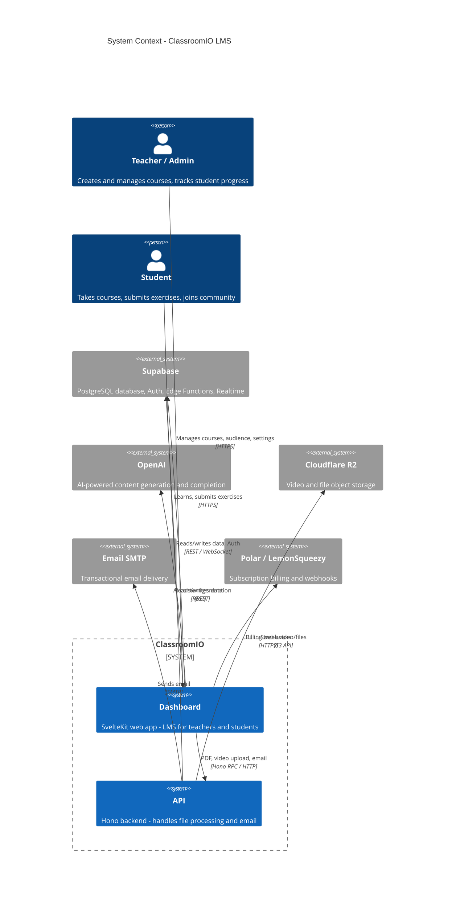

# C4 Layer 1 — System Context

```mermaid
C4Context
  title System Context - ClassroomIO LMS

  Person(teacher, "Teacher / Admin", "Creates and manages courses, tracks student progress")
  Person(student, "Student", "Takes courses, submits exercises, joins community")

  System_Boundary(classroomio, "ClassroomIO") {
    System(dashboard, "Dashboard", "SvelteKit web app - LMS for teachers and students")
    System(api, "API", "Hono backend - handles file processing and email")
  }

  System_Ext(supabase, "Supabase", "PostgreSQL database, Auth, Edge Functions, Realtime")
  System_Ext(openai, "OpenAI", "AI-powered content generation and completion")
  System_Ext(cloudflare, "Cloudflare R2", "Video and file object storage")
  System_Ext(smtp, "Email SMTP", "Transactional email delivery")
  System_Ext(billing, "Polar / LemonSqueezy", "Subscription billing and webhooks")

  Rel(teacher, dashboard, "Manages courses, audience, settings", "HTTPS")
  Rel(student, dashboard, "Learns, submits exercises", "HTTPS")
  Rel(dashboard, supabase, "Reads/writes data, Auth", "REST / WebSocket")
  Rel(dashboard, api, "PDF, video upload, email", "Hono RPC / HTTP")
  Rel(dashboard, openai, "AI content generation", "REST")
  Rel(dashboard, billing, "Billing webhooks", "HTTPS")
  Rel(api, supabase, "Reads/writes data", "REST")
  Rel(api, cloudflare, "Stores video/files", "S3 API")
  Rel(api, smtp, "Sends email", "SMTP")
```
