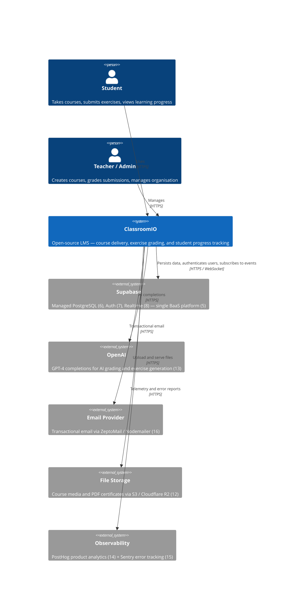

# C4 Level 1 — System Context

> **Scope:** ClassroomIO as a black box, its users, and the external systems it depends on.

---

## Tech Stack Footnotes

| # | Technology | Description |
|---|-----------|-------------|
| 5 | **Supabase** | Open-source Firebase alternative providing a managed PostgreSQL database, Auth, Realtime subscriptions, and Storage in a single platform. Both the Dashboard and API interact with Supabase via the `@supabase/supabase-js` client SDK. |
| 6 | **PostgreSQL** | Open-source relational database backing all persistent ClassroomIO data. Row-Level Security (RLS) policies enforce multi-tenant data isolation at the database layer. |
| 7 | **Supabase Auth** | JWT-based authentication service supporting email/password, magic links, and OAuth providers. The API validates tokens via middleware in `middlewares/auth.ts`; the Dashboard uses the Supabase JS client for session management. |
| 8 | **Supabase Realtime** | WebSocket broadcast layer built on PostgreSQL logical replication that streams row-change events to subscribers. The Dashboard uses it for live activity feeds and notification updates. |
| 12 | **AWS S3 / Cloudflare R2** | Object storage for course media uploads, lesson attachments, and generated PDF certificates. The API pre-signs upload URLs via `@aws-sdk/client-s3` and uses Cloudflare R2 as the preferred production backend. |
| 13 | **OpenAI GPT-4** | Completions API used for AI-powered exercise grading, custom prompt responses, and exercise generation. All OpenAI calls originate from SvelteKit server routes — never the browser — to keep API keys server-side. |
| 14 | **PostHog** | Product analytics SDK (`posthog-js`) embedded in the Dashboard for event tracking and user flow analysis. Events are captured without PII and can be gated with feature flags. |
| 15 | **Sentry** | Error monitoring and performance tracing integrated into both the Dashboard (browser SDK) and the API (`@sentry/node`). Breadcrumbs and stack traces are sent to Sentry cloud for alerting and debugging. |
| 16 | **Nodemailer / ZeptoMail** | Dual-strategy email delivery — Nodemailer is the local development fallback and ZeptoMail (`zeptomail` package) is the production transactional provider. Email templates are rendered server-side in the API's `services/mail.ts`. |
