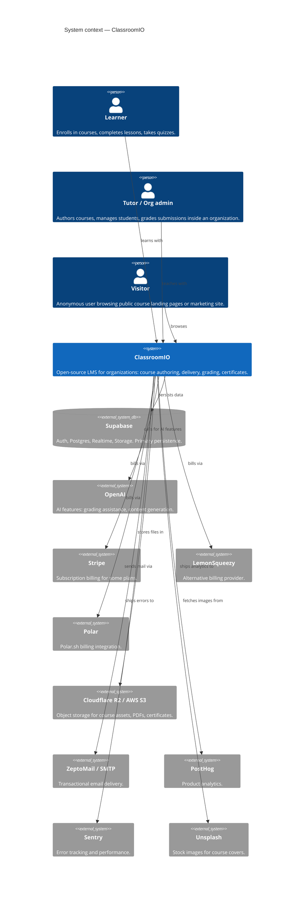

# Layer 1 — System context

> Generated by `.claude/skills/c4-model`. Edit `references/classroomio-system.md` to change Layer 1 facts.

```mermaid
C4Context
  title System context — ClassroomIO

  Person(learner, "Learner", "Enrolls in courses, completes lessons, takes quizzes.")
  Person(tutor, "Tutor / Org admin", "Authors courses, manages students, grades submissions inside an organization.")
  Person(visitor, "Visitor", "Anonymous user browsing public course landing pages or marketing site.")

  System(classroomio, "ClassroomIO", "Open-source LMS for organizations: course authoring, delivery, grading, certificates.")

  SystemDb_Ext(supabase, "Supabase", "Auth, Postgres, Realtime, Storage. Primary persistence.")
  System_Ext(openai, "OpenAI", "AI features: grading assistance, content generation.")
  System_Ext(stripe, "Stripe", "Subscription billing for some plans.")
  System_Ext(lemonsqueezy, "LemonSqueezy", "Alternative billing provider.")
  System_Ext(polar, "Polar", "Polar.sh billing integration.")
  System_Ext(r2, "Cloudflare R2 / AWS S3", "Object storage for course assets, PDFs, certificates.")
  System_Ext(zeptomail, "ZeptoMail / SMTP", "Transactional email delivery.")
  System_Ext(posthog, "PostHog", "Product analytics.")
  System_Ext(sentry, "Sentry", "Error tracking and performance.")
  System_Ext(unsplash, "Unsplash", "Stock images for course covers.")

  Rel(learner, classroomio, "learns with")
  Rel(tutor, classroomio, "teaches with")
  Rel(visitor, classroomio, "browses")
  Rel(classroomio, supabase, "persists data")
  Rel(classroomio, openai, "calls for AI features")
  Rel(classroomio, stripe, "bills via")
  Rel(classroomio, lemonsqueezy, "bills via")
  Rel(classroomio, polar, "bills via")
  Rel(classroomio, r2, "stores files in")
  Rel(classroomio, zeptomail, "sends mail via")
  Rel(classroomio, posthog, "ships analytics to")
  Rel(classroomio, sentry, "ships errors to")
  Rel(classroomio, unsplash, "fetches images from")
```
