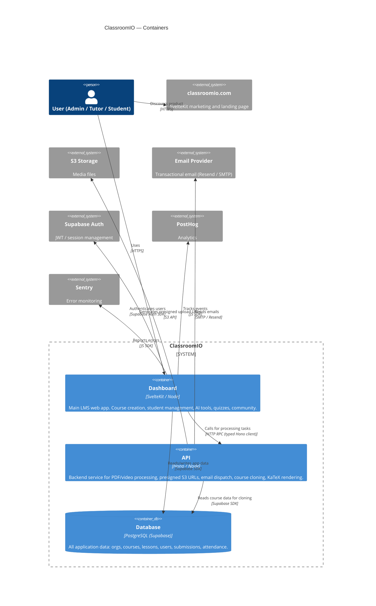

# C4 Layer 2 — Containers

```mermaid
C4Container
  title ClassroomIO — Containers

  Person(user, "User (Admin / Tutor / Student)")

  System_Boundary(classroomio, "ClassroomIO") {
    Container(dashboard, "Dashboard", "SvelteKit / Node", "Main LMS web app. Course creation, student management, AI tools, quizzes, community.")
    Container(api, "API", "Hono / Node", "Backend service for PDF/video processing, presigned S3 URLs, email dispatch, course cloning, KaTeX rendering.")
    ContainerDb(db, "Database", "PostgreSQL (Supabase)", "All application data: orgs, courses, lessons, users, submissions, attendance.")
  }

  System_Ext(marketing, "classroomio.com", "SvelteKit marketing and landing page")
  System_Ext(s3, "S3 Storage", "Media files")
  System_Ext(email, "Email Provider", "Transactional email (Resend / SMTP)")
  System_Ext(supabase_auth, "Supabase Auth", "JWT / session management")
  System_Ext(posthog, "PostHog", "Analytics")
  System_Ext(sentry, "Sentry", "Error monitoring")

  Rel(user, dashboard, "Uses", "HTTPS")
  Rel(dashboard, api, "Calls for processing tasks", "HTTP RPC (typed Hono client)")
  Rel(dashboard, db, "Reads/writes app data", "Supabase SDK")
  Rel(dashboard, supabase_auth, "Authenticates users", "Supabase Auth SDK")
  Rel(dashboard, posthog, "Tracks events", "JS SDK")
  Rel(dashboard, sentry, "Reports errors", "JS SDK")
  Rel(api, db, "Reads course data for cloning", "Supabase SDK")
  Rel(api, s3, "Generates presigned upload URLs", "S3 API")
  Rel(api, email, "Sends emails", "SMTP / Resend")
  Rel(user, marketing, "Discovers product", "HTTPS")
```
