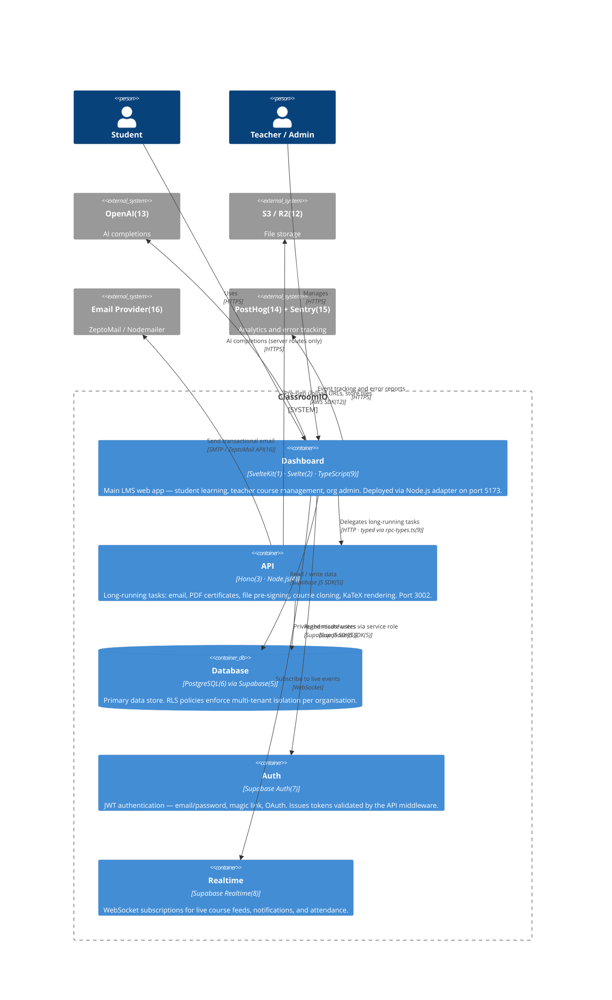

# C4 Level 2 — Containers

> **Scope:** The deployable units inside ClassroomIO and how they communicate.

---

## Tech Stack Footnotes

| # | Technology | Description |
|---|-----------|-------------|
| 1 | **SvelteKit 1.x** | Full-stack Svelte framework with file-based routing, server-side rendering, server actions, and API endpoints. The Dashboard app uses the Node.js adapter (`@sveltejs/adapter-node`) for deployment. |
| 2 | **Svelte 4** | Reactive UI component compiler that outputs vanilla JavaScript with zero runtime framework overhead. Components use `$:` reactive declarations compiled away entirely at build time. |
| 3 | **Hono 4** | Lightweight, edge-first HTTP framework for Node.js and Cloudflare Workers with a typed middleware chain, Zod validation helpers, and built-in OpenAPI support. |
| 4 | **Node.js** | JavaScript runtime (v20) hosting the Hono API server as a long-running process. The API handles tasks that would time out or be too slow for SvelteKit server routes. |
| 5 | **Supabase** | Open-source Firebase alternative providing a managed PostgreSQL database, Auth, Realtime subscriptions, and Storage in one platform. Both apps use `@supabase/supabase-js` for all Supabase interactions. |
| 6 | **PostgreSQL** | Open-source relational database backing all persistent ClassroomIO data. Row-Level Security (RLS) policies enforce multi-tenant data isolation at the database layer. |
| 7 | **Supabase Auth** | JWT-based authentication service supporting email/password, magic links, and OAuth providers. The API validates tokens server-side via `middlewares/auth.ts`; the Dashboard manages sessions via the JS client. |
| 8 | **Supabase Realtime** | WebSocket broadcast layer built on PostgreSQL logical replication that streams row-change events to subscribers. The Dashboard uses it for live activity feeds and notification updates. |
| 9 | **TypeScript** | Statically typed superset of JavaScript used across the entire monorepo. The Dashboard imports `@cio/api/rpc-types` for end-to-end type safety on all API calls — type errors surface at compile time. |
| 12 | **AWS S3 / Cloudflare R2** | Object storage for course media uploads, lesson attachments, and generated PDF certificates. The API pre-signs upload URLs via `@aws-sdk/client-s3`; Cloudflare R2 is the preferred production backend. |
| 13 | **OpenAI GPT-4** | Completions API used for AI-powered exercise grading, custom prompt responses, and exercise generation. All calls originate from SvelteKit server routes — never the browser — to keep API keys server-side. |
| 14 | **PostHog** | Product analytics SDK (`posthog-js`) embedded in the Dashboard for event tracking, session recording, and feature flags. Captures user flows without PII by default. |
| 15 | **Sentry** | Error monitoring and performance tracing in both the Dashboard (browser SDK) and the API (`@sentry/node` + profiling). Sends breadcrumbs and stack traces to Sentry cloud for alerting. |
| 16 | **Nodemailer / ZeptoMail** | Dual-strategy email delivery — Nodemailer is the local development fallback and ZeptoMail (`zeptomail`) is the production transactional provider. All email templates are rendered in the API's mail service. |
