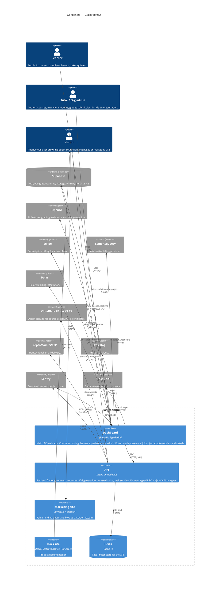

# Layer 2 — Containers

> Generated by `.claude/skills/c4-model`. Edit `references/classroomio-system.md` to change Layer 2 facts.

```mermaid
C4Container
  title Containers — ClassroomIO

  Person(learner, "Learner", "Enrolls in courses, completes lessons, takes quizzes.")
  Person(tutor, "Tutor / Org admin", "Authors courses, manages students, grades submissions inside an organization.")
  Person(visitor, "Visitor", "Anonymous user browsing public course landing pages or marketing site.")

  System_Boundary(classroomio, "ClassroomIO") {
    Container(dashboard, "Dashboard", "SvelteKit, TypeScript", "Main LMS web app. Course authoring, learner experience, org admin. Runs on adapter-vercel (cloud) or adapter-node (self-hosted).")
    Container(api, "API", "Hono on Node 20", "Backend for long-running processes: PDF generation, course cloning, mail sending. Exposes typed RPC at @cio/api/rpc-types.")
    Container(landing, "Marketing site", "SvelteKit + mdsvex", "Public landing pages and blog at classroomio.com.")
    Container(docs, "Docs site", "React, TanStack Router, Fumadocs", "Product documentation.")
    ContainerDb(redis, "Redis", "Redis 7", "Rate-limiter state for the API.")
  }

  SystemDb_Ext(supabase, "Supabase", "Auth, Postgres, Realtime, Storage. Primary persistence.")
  System_Ext(openai, "OpenAI", "AI features: grading assistance, content generation.")
  System_Ext(stripe, "Stripe", "Subscription billing for some plans.")
  System_Ext(lemonsqueezy, "LemonSqueezy", "Alternative billing provider.")
  System_Ext(polar, "Polar", "Polar.sh billing integration.")
  System_Ext(r2, "Cloudflare R2 / AWS S3", "Object storage for course assets, PDFs, certificates.")
  System_Ext(zeptomail, "ZeptoMail / SMTP", "Transactional email delivery.")
  System_Ext(posthog, "PostHog", "Product analytics.")
  System_Ext(sentry, "Sentry", "Error tracking and performance.")
  System_Ext(unsplash, "Unsplash", "Stock images for course covers.")

  Rel(learner, dashboard, "uses", "HTTPS")
  Rel(tutor, dashboard, "uses", "HTTPS")
  Rel(visitor, landing, "visits", "HTTPS")
  Rel(visitor, dashboard, "views public course pages", "HTTPS")
  Rel(dashboard, api, "RPC", "HTTPS/JSON")
  Rel(dashboard, supabase, "auth, queries, realtime", "PostgREST, WS")
  Rel(api, supabase, "service-role queries", "PostgREST")
  Rel(api, redis, "rate-limit", "TCP")
  Rel(api, r2, "stores assets", "S3 API")
  Rel(api, zeptomail, "sends mail", "SMTP/API")
  Rel(dashboard, openai, "AI features", "HTTPS")
  Rel(dashboard, stripe, "checkout, webhooks", "HTTPS")
  Rel(dashboard, lemonsqueezy, "checkout, webhooks", "HTTPS")
  Rel(dashboard, polar, "checkout, webhooks", "HTTPS")
  Rel(dashboard, unsplash, "stock images", "HTTPS")
  Rel(dashboard, posthog, "events", "HTTPS")
  Rel(dashboard, sentry, "errors", "HTTPS")
  Rel(api, sentry, "errors", "HTTPS")
  Rel(docs, visitor, "is read by", "HTTPS")
```
