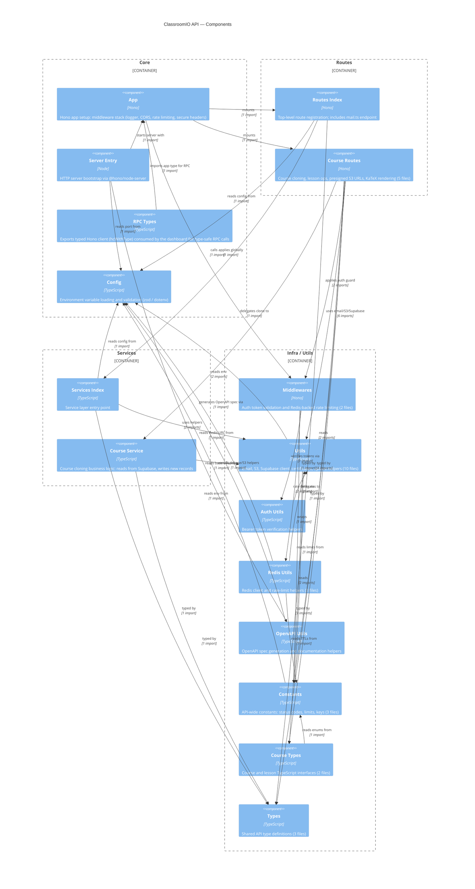

# C4 Layer 3 — API Components

> Generated from AST extraction (`docs/c4/components.json`). All relationships shown (weight ≥ 1).
> Extracted: 16 components, 34 relationships (2026-03-13).

```mermaid
C4Component
  title ClassroomIO API — Components

  Container_Boundary(core_b, "Core") {
    Component(app, "App", "Hono", "Hono app setup: middleware stack (logger, CORS, rate limiting, secure headers)")
    Component(index, "Server Entry", "Node", "HTTP server bootstrap via @hono/node-server")
    Component(rpc_types, "RPC Types", "TypeScript", "Exports typed Hono client (hcWithType) consumed by the dashboard for type-safe RPC calls")
    Component(config, "Config", "TypeScript", "Environment variable loading and validation (zod / dotenv)")
  }

  Container_Boundary(routes_b, "Routes") {
    Component(routes_root, "Routes Index", "Hono", "Top-level route registration; includes mail.ts endpoint")
    Component(routes_course, "Course Routes", "Hono", "Course cloning, lesson ops, presigned S3 URLs, KaTeX rendering (5 files)")
  }

  Container_Boundary(services_b, "Services") {
    Component(services_root, "Services Index", "TypeScript", "Service layer entry point")
    Component(services_course, "Course Service", "TypeScript", "Course cloning business logic: reads from Supabase, writes new records")
  }

  Container_Boundary(infra_b, "Infra / Utils") {
    Component(middlewares, "Middlewares", "Hono", "Auth token validation and Redis-backed rate limiting (2 files)")
    Component(utils, "Utils", "TypeScript", "Email, S3, Supabase client, certificates, upload helpers (10 files)")
    Component(utils_auth, "Auth Utils", "TypeScript", "Bearer token verification helpers")
    Component(utils_redis, "Redis Utils", "TypeScript", "Redis client and rate-limit helpers (3 files)")
    Component(utils_openapi, "OpenAPI Utils", "TypeScript", "OpenAPI spec generation and documentation helpers")
    Component(constants, "Constants", "TypeScript", "API-wide constants: status codes, limits, keys (3 files)")
    Component(types_course, "Course Types", "TypeScript", "Course and lesson TypeScript interfaces (2 files)")
    Component(types_root, "Types", "TypeScript", "Shared API type definitions (3 files)")
  }

  Rel(index, app, "starts server with", "1 import")
  Rel(index, utils_openapi, "generates OpenAPI spec via", "1 import")
  Rel(index, config, "reads port from", "1 import")
  Rel(rpc_types, app, "imports app type for RPC", "1 import")
  Rel(app, routes_course, "mounts", "1 import")
  Rel(app, routes_root, "mounts", "1 import")
  Rel(app, middlewares, "applies globally", "1 import")
  Rel(routes_course, utils, "uses email/S3/Supabase", "6 imports")
  Rel(routes_course, types_course, "typed by", "4 imports")
  Rel(routes_course, middlewares, "applies auth guard", "2 imports")
  Rel(routes_course, constants, "reads", "2 imports")
  Rel(routes_course, services_course, "delegates clone to", "1 import")
  Rel(routes_course, types_root, "typed by", "1 import")
  Rel(routes_root, services_root, "calls", "1 import")
  Rel(routes_root, types_root, "typed by", "1 import")
  Rel(routes_root, config, "reads config from", "1 import")
  Rel(utils, types_course, "typed by", "3 imports")
  Rel(utils, constants, "reads", "2 imports")
  Rel(utils, config, "reads env", "2 imports")
  Rel(middlewares, utils_redis, "rate-limits via", "2 imports")
  Rel(middlewares, utils_auth, "verifies tokens via", "1 import")
  Rel(middlewares, constants, "reads limits from", "1 import")
  Rel(services_root, utils, "uses helpers", "2 imports")
  Rel(services_root, types_root, "typed by", "1 import")
  Rel(services_root, config, "reads config from", "1 import")
  Rel(services_course, utils, "uses Supabase/S3 helpers", "1 import")
  Rel(services_course, types_root, "typed by", "1 import")
  Rel(constants, config, "reads env from", "1 import")
  Rel(types_course, constants, "reads enums from", "1 import")
  Rel(utils_auth, utils, "delegates to", "1 import")
  Rel(utils_openapi, config, "reads base URL from", "1 import")
  Rel(utils_redis, utils, "wraps", "1 import")
  Rel(utils_redis, constants, "reads TTLs from", "1 import")
  Rel(utils_redis, config, "reads Redis URL from", "1 import")
```
