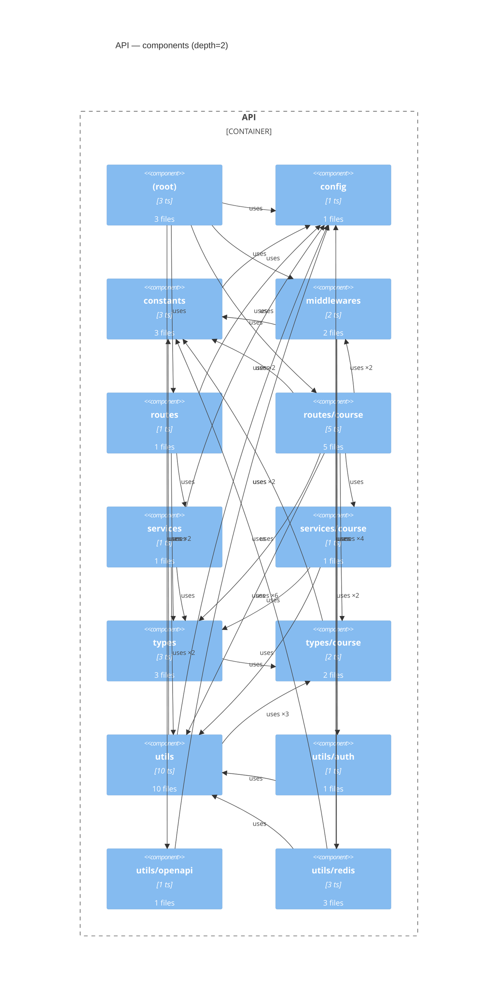

# Layer 3 — API components

> Generated by `.claude/skills/c4-model` from `docs/c4/.extraction/api.json`.
> Source root: `apps/api/src`, depth=2.

- Components kept: **14** of 14
- Edges drawn: **33** of 33
