# C4 Level 3 — API Container Components

> **Scope:** Internal components of `apps/api` (`@cio/api`).  
> **Derived from:** `docs/c4/ast-api.json` (AST extraction at depth=2, 2026-05-15).  
> **Source:** `apps/api/src/` — 37 TypeScript files across 14 components.

```mermaid
C4Component
  Container_Boundary(api_boundary, "API — @cio/api · Hono(3) · Node.js(4)") {

    Component(c_root, "App Entry", "Hono(3) · dotenv", "app.ts: Hono app with middleware chain and route mounting. index.ts: HTTP server startup. rpc-types.ts: exported RPC type definitions consumed by the Dashboard.")

    Component(c_config, "config", "Zod(10)", "config/env.ts — typed environment variable access. Parses and validates all env vars with Zod at startup; throws on missing required values.")

    Component(c_constants, "constants", "TypeScript(9)", "Rate-limit thresholds, upload size limits, and shared magic constants. Depends on config to read env-driven limits.")

    Component(c_middlewares, "middlewares", "Hono(3)", "auth.ts: validates Supabase JWT and injects user context. rate-limiter.ts: applies per-IP limits using Redis sliding window.")

    Component(c_routes, "routes", "Hono(3) · Zod(10)", "routes/mail.ts — POST /mail endpoint. Validates request body, delegates to the mail service. Single-file route module.")

    Component(c_routes_course, "routes/course", "Hono(3) · KaTeX(20) · Zod(10)", "5 route handlers: course CRUD, lesson CRUD, course cloning, file pre-signing, KaTeX rendering. All require auth middleware.")

    Component(c_services, "services", "Nodemailer(16)", "services/mail.ts — email sending business logic. Selects ZeptoMail or Nodemailer transport based on env, renders HTML templates, delivers email.")

    Component(c_services_course, "services/course", "Supabase(5)", "services/course/clone.ts — deep-copies a course with all lessons and questions. Runs multiple Supabase queries transactionally.")

    Component(c_types, "types", "Zod(10)", "TypeScript interfaces for database rows (database.ts), mail payloads (mail.ts), and shared domain types (index.ts). No logic — pure type declarations.")

    Component(c_types_course, "types/course", "Zod(10)", "TypeScript interfaces for Course and Lesson entities including question schemas. Imports shared constants for enum values.")

    Component(c_utils, "utils", "Supabase(5) · S3/R2(12) · Nodemailer(16)", "10 utility modules: Supabase client factory, S3/R2 client factory, email helpers, certificate PDF generation, course/lesson helpers, unique ID generator, upload validation.")

    Component(c_utils_auth, "utils/auth", "Supabase(5)", "validate-user.ts — extracts and verifies the user JWT from the Hono context. Returns the authenticated user record or throws 401.")

    Component(c_utils_openapi, "utils/openapi", "Hono(3)", "Mounts the Scalar API reference UI at /reference. Generates the OpenAPI spec from Hono route definitions for interactive documentation.")

    Component(c_utils_redis, "utils/redis", "Redis(11)", "Redis client initialisation (redis.ts), typed cache key generators (key-generators.ts), and Hono rate-limiter middleware factory (limiter.ts).")
  }

  Component_Ext(ext_supabase, "Supabase DB (5)", "PostgreSQL via Supabase JS SDK")
  Component_Ext(ext_s3, "S3 / R2 (12)", "AWS S3 or Cloudflare R2")
  Component_Ext(ext_email, "Email Provider (16)", "ZeptoMail or Nodemailer SMTP")
  Component_Ext(ext_redis, "Redis (11)", "ioredis connection")

  Rel(c_root, c_config, "loads env")
  Rel(c_root, c_middlewares, "registers")
  Rel(c_root, c_routes, "mounts")
  Rel(c_root, c_routes_course, "mounts")
  Rel(c_root, c_utils_openapi, "mounts /reference")

  Rel(c_middlewares, c_utils_auth, "calls for JWT validation")
  Rel(c_middlewares, c_utils_redis, "applies rate limit")
  Rel(c_middlewares, c_constants, "reads rate limit config")

  Rel(c_routes, c_services, "delegates to mail service")
  Rel(c_routes, c_types, "validates with")

  Rel(c_routes_course, c_middlewares, "guarded by")
  Rel(c_routes_course, c_services_course, "delegates clone to")
  Rel(c_routes_course, c_types_course, "validates with")

  Rel(c_services, c_utils, "uses email helpers")
  Rel(c_services_course, c_utils, "uses Supabase client")

  Rel(c_utils, ext_supabase, "queries", "Supabase JS SDK")
  Rel(c_utils, ext_s3, "pre-signs + stores files", "AWS SDK")
  Rel(c_utils, ext_email, "delivers email", "SMTP / ZeptoMail API")

  Rel(c_utils_auth, c_utils, "delegates Supabase client")
  Rel(c_utils_redis, ext_redis, "connects to", "ioredis")
  Rel(c_utils_redis, c_config, "reads REDIS_URL")
```

---

## What is AST?

An **Abstract Syntax Tree (AST)** is a tree-shaped data structure that represents source code structure without whitespace, comments, or syntactic sugar. Every construct in the language — an `import` statement, a function definition, a class declaration — becomes a node, with children representing its sub-constructs.

This diagram was derived by running `ts-morph` (a TypeScript compiler API wrapper) over every `.ts` file in `apps/api/src/`. For each file, the extractor reads its import declarations and resolves each module specifier to either another file in the codebase (internal dependency) or an npm package name (external). Files are then grouped by their directory path up to depth=2 (e.g., `utils/redis/redis.ts` → component key `utils/redis`). The resulting directed graph of directory→directory dependencies is the input for this diagram — no component boundaries were hardcoded.

---

## Tech Stack Footnotes

| # | Technology | Description |
|---|-----------|-------------|
| 3 | **Hono 4** | Lightweight, edge-first HTTP framework for Node.js and Cloudflare Workers with a typed middleware chain, Zod validation helpers, and built-in OpenAPI support. Used for all route definitions, middleware registration, and the HTTP server adapter. |
| 4 | **Node.js** | JavaScript runtime (v20) hosting the Hono API server as a long-running process on port 3002. The API handles tasks that would time out in SvelteKit server routes: email, PDF generation, file pre-signing, and course cloning. |
| 5 | **Supabase** | Open-source Firebase alternative providing a managed PostgreSQL database with Auth, Realtime, and Storage. The API uses the Supabase service-role key for privileged server-side operations that bypass Row-Level Security. |
| 9 | **TypeScript** | Statically typed superset of JavaScript used for all API source files. The `rpc-types.ts` export is consumed by the Dashboard for compile-time type safety on all API calls. |
| 10 | **Zod** | TypeScript-first schema validation library used for environment variable parsing (`config/env.ts`) and HTTP request body validation (`@hono/zod-validator`). Zod schemas serve as both runtime guards and TypeScript type generators. |
| 11 | **Redis (ioredis)** | In-memory key-value store used for sliding-window rate limiting and response caching. The `utils/redis` module centralises key generation patterns and exposes a Hono middleware factory for per-route rate limits. |
| 12 | **AWS S3 / Cloudflare R2** | Object storage for course media, lesson attachments, and generated PDF certificates. The API uses `@aws-sdk/client-s3` and `@aws-sdk/s3-request-presigner` to generate short-lived pre-signed upload and download URLs. |
| 16 | **Nodemailer / ZeptoMail** | Dual-strategy email delivery — Nodemailer is the local development fallback and ZeptoMail (`zeptomail`) is the production transactional provider. The mail service selects the transport based on the `EMAIL_PROVIDER` environment variable. |
| 20 | **KaTeX** | Fast, server-side LaTeX math renderer. The `routes/course/katex.ts` endpoint accepts LaTeX strings and returns rendered HTML, allowing lesson content to display mathematical formulas without client-side rendering. |
