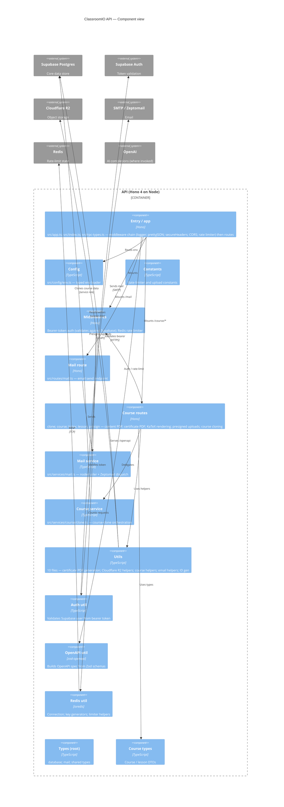

# C4 Layer 3 — API container

Components inside `apps/api` (Hono 4 on Node). Derived from AST extraction
(`docs/c4/components.json`, depth=2) — regenerate with
`node .claude/skills/c4-model/scripts/extract-components.mjs` whenever the
source layout changes.

## Component breakdown (from `components.json`)

| Component | Files | Notes |
|---|---:|---|
| `(top)` | 3 | `app.ts`, `index.ts`, `rpc-types.ts` |
| `config` | 1 | Env loader |
| `constants` | 3 | Rate-limiter; upload |
| `middlewares` | 2 | Auth; rate limiter |
| `routes` | 1 | `mail.ts` |
| `routes/course` | 5 | clone; course; katex; lesson; presign |
| `services` | 1 | mail |
| `services/course` | 1 | clone |
| `types` | 3 | database; index; mail |
| `types/course` | 2 | index; lesson |
| `utils` | 10 | certificate; cloudflare; course; email; genUniqueId; … |
| `utils/auth` | 1 | validate-user |
| `utils/openapi` | 1 | OpenAPI spec |
| `utils/redis` | 3 | key-generators; limiter; redis |
