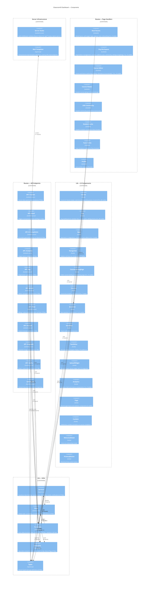

# C4 Layer 3 — Dashboard Components

> Generated from AST extraction (`docs/c4/components.json`). Relationships shown have weight ≥ 2.
> Extracted: 42 components, 61 relationships (2026-03-13).

```mermaid
C4Component
  title ClassroomIO Dashboard — Components

  Container_Boundary(server_b, "Server Infrastructure") {
    Component(hooks, "Server Hooks", "SvelteKit server", "Auth middleware: validates Bearer tokens for /api/* routes, injects user_id")
    Component(mail, "Mail Templates", "TypeScript", "Transactional email template definitions used by API email endpoints")
  }

  Container_Boundary(routes_b, "Routes — Page Handlers") {
    Component(routes_root, "Root Routes", "SvelteKit", "Global layout, auth pages: login, signup, reset, onboarding (2 ts, 3 svelte)")
    Component(routes_org, "Org Workspace", "SvelteKit", "Organization management: courses, audience, quiz, community, settings (/org/[slug], 7 ts, 15 svelte)")
    Component(routes_courses, "Course Editor", "SvelteKit", "Course and lesson authoring, grading, attendance (/courses/[id], 13 ts, 14 svelte)")
    Component(routes_course, "Course Viewer", "SvelteKit", "Student course-taking UI (/course/[slug])")
    Component(routes_lms, "LMS Community", "SvelteKit", "Student community portal (/lms/community)")
    Component(routes_invite_s, "Student Invite", "SvelteKit", "Student invitation acceptance flow (/invite/s)")
    Component(routes_invite_t, "Tutor Invite", "SvelteKit", "Tutor invitation acceptance flow (/invite/t)")
    Component(routes_profile, "Profile", "SvelteKit", "User profile view (/profile/[id])")
  }

  Container_Boundary(api_routes_b, "Routes — API Endpoints") {
    Component(api_courses, "API: Courses", "SvelteKit server", "Course data queries and mutations (7 files)")
    Component(api_email, "API: Email", "SvelteKit server", "Triggers transactional email sending (11 files)")
    Component(api_completion, "API: AI Completion", "SvelteKit server", "AI content generation proxy via OpenAI (4 files)")
    Component(api_analytics, "API: Analytics", "SvelteKit server", "Usage metrics endpoints (2 files)")
    Component(api_org, "API: Org", "SvelteKit server", "Organization operations (2 files)")
    Component(api_admin, "API: Admin", "SvelteKit server", "Admin management endpoints (2 files)")
    Component(api_polar, "API: Polar", "SvelteKit server", "Billing / subscription webhooks via Polar (3 files)")
    Component(api_domain, "API: Domain", "SvelteKit server", "Custom domain validation (1 file)")
    Component(api_unsplash, "API: Unsplash", "SvelteKit server", "Unsplash image search proxy (1 file)")
    Component(api_verify, "API: Verify", "SvelteKit server", "Email / invite token verification (1 file)")
    Component(api_csp, "CSP Report", "SvelteKit server", "Content Security Policy violation reporting")
  }

  Container_Boundary(components_b, "Lib — UI Components") {
    Component(comp_course, "Course", "Svelte", "Course UI: lesson viewer, exercise editor, grading panel, AI tools (23 ts, 68 svelte)")
    Component(comp_org, "Org", "Svelte", "Org dashboard UI: member lists, course cards, settings forms (2 ts, 44 svelte)")
    Component(comp_apps, "Apps", "Svelte", "App-level UI: integrations, modals, rich text editors (6 ts, 9 svelte)")
    Component(comp_nav, "Navigation", "Svelte", "Sidebar and top-nav components (7 svelte)")
    Component(comp_clp, "CourseLandingPage", "Svelte", "Public course landing and marketing page (4 ts, 15 svelte)")
    Component(comp_courses, "Courses", "Svelte", "Course list, browse, and card UI (3 ts, 7 svelte)")
    Component(comp_question, "Question", "Svelte", "Quiz question components (1 ts, 6 svelte)")
    Component(comp_snackbar, "Snackbar", "Svelte", "Toast notification component")
    Component(comp_text_editor, "TextEditor", "Svelte", "Rich text editor wrapper (Tiptap / ProseMirror)")
    Component(comp_upload, "UploadWidget", "Svelte", "File and image upload widget with S3 integration")
    Component(comp_analytics, "Analytics", "Svelte", "Analytics chart and metrics components (1 ts, 3 svelte)")
    Component(comp_page, "Page", "Svelte", "Shared page layout and skeleton components (5 svelte)")
    Component(comp_confetti, "Confetti", "Svelte", "Celebratory confetti animation on course completion")
    Component(comp_welcome, "WelcomeModal", "Svelte", "First-run onboarding modal")
    Component(comp_button, "PrimaryButton", "Svelte", "Shared primary action button")
  }

  Container_Boundary(utils_b, "Lib — Utils") {
    Component(services, "Services", "TypeScript", "Supabase data-fetching: courses, orgs, attendance, marks, notifications (21 files)")
    Component(store, "Store", "Svelte stores", "Global state: currentOrg, currentUser, app, attendance (5 files)")
    Component(functions, "Functions", "TypeScript", "Pure utility functions: date, course, slug, domain, validation (38 files)")
    Component(constants, "Constants", "TypeScript", "App-wide constants: roles, routes, quiz config, feature flags (9 files)")
    Component(types, "Types", "TypeScript", "Shared TypeScript type definitions (9 files)")
  }

  Rel(api_courses, functions, "uses", "14 imports")
  Rel(services, functions, "uses", "12 imports")
  Rel(api_email, mail, "renders", "11 imports")
  Rel(comp_course, types, "typed by", "9 imports")
  Rel(services, types, "typed by", "9 imports")
  Rel(functions, services, "calls", "4 imports")
  Rel(functions, constants, "reads", "4 imports")
  Rel(functions, store, "reads", "3 imports")
  Rel(functions, types, "typed by", "3 imports")
  Rel(store, types, "typed by", "3 imports")
  Rel(services, store, "updates", "3 imports")
  Rel(api_analytics, functions, "uses", "3 imports")
  Rel(comp_course, functions, "uses", "3 imports")
  Rel(routes_root, functions, "uses", "2 imports")
  Rel(store, constants, "reads", "2 imports")
  Rel(services, constants, "reads", "2 imports")
  Rel(api_admin, functions, "uses", "2 imports")
  Rel(api_analytics, types, "typed by", "2 imports")
  Rel(api_courses, types, "typed by", "2 imports")
  Rel(api_email, functions, "uses", "2 imports")
  Rel(api_org, functions, "uses", "2 imports")
  Rel(routes_invite_t, functions, "uses", "2 imports")
  Rel(comp_course, comp_question, "embeds", "2 imports")
```
