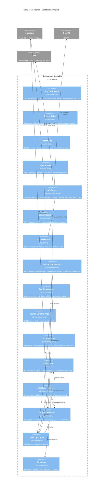

# C4 Layer 3 — Dashboard Components

```mermaid
C4Component
  title Component diagram - Dashboard SvelteKit

  Container_Boundary(dashboard, "Dashboard SvelteKit") {
    Component(routes_org, "Org Dashboard", "SvelteKit Route", "Teacher/admin area: course management, audience, community, settings")
    Component(routes_courses, "Course Editor", "SvelteKit Route", "Full course editor: lessons, submissions, marks, attendance, analytics")
    Component(routes_lms, "Student LMS", "SvelteKit Route", "Student-facing: my learning, exercises, community, explore")
    Component(routes_auth, "Auth Routes", "SvelteKit Route", "Login, signup, forgot password, reset, onboarding, invite")
    Component(routes_api, "API Routes", "SvelteKit Server Route", "Server-side endpoints: AI completion, email, courses, org, billing webhooks")
    Component(hooks, "Server Hooks", "SvelteKit Hook", "JWT validation on API routes, Supabase client singleton")
    Component(mail_templates, "Mail Templates", "TypeScript", "Email template definitions consumed by API routes")
    Component(comp_course, "Course Components", "Svelte Component", "Rich course UI: lesson viewer, submissions, marks, attendance, certificates")
    Component(comp_org, "Org Components", "Svelte Component", "Org management UI: settings, billing, community, audience")
    Component(comp_landing, "Course Landing Page", "Svelte Component", "Public course landing page components")
    Component(comp_ui, "UI Primitives", "Svelte Component", "Shared UI: buttons, modal, form, navigation, snackbar, tabs, icons")
    Component(utils_store, "Svelte Stores", "Svelte Store", "Global state: currentOrg, orgs, orgTeam, orgAudience, user, app")
    Component(utils_services, "Supabase Services", "Supabase Service", "Data fetching and business logic calling Supabase directly")
    Component(utils_functions, "Helper Functions", "Helper Functions", "Pure utility functions shared across routes and components")
    Component(utils_types, "TypeScript Types", "TypeScript Types", "Shared domain type definitions")
    Component(utils_constants, "Constants", "TypeScript Types", "App-wide constants and configuration values")
  }

  System_Ext(supabase, "Supabase", "PostgreSQL + Auth + Realtime")
  System_Ext(openai, "OpenAI", "LLM API")
  System_Ext(api_container, "API", "Hono / Node.js - file processing and email")

  Rel(utils_services, supabase, "CRUD data", "REST PostgREST")
  Rel(utils_services, utils_functions, "Uses helpers", "")
  Rel(utils_services, utils_types, "Typed by", "")
  Rel(utils_services, utils_store, "Updates stores", "")
  Rel(utils_functions, utils_store, "Reads/updates state", "")
  Rel(utils_functions, utils_services, "Delegates data ops", "")
  Rel(utils_functions, utils_constants, "Reads constants", "")
  Rel(utils_functions, utils_types, "Typed by", "")
  Rel(utils_store, utils_types, "Typed by", "")
  Rel(comp_course, utils_types, "Typed by", "")
  Rel(comp_course, utils_functions, "Uses helpers", "")
  Rel(routes_api, utils_functions, "Uses helpers", "")
  Rel(routes_api, mail_templates, "Renders email templates", "")
  Rel(routes_api, openai, "AI completion", "REST")
  Rel(routes_api, api_container, "Proxies file/email ops", "Hono RPC")
  Rel(hooks, supabase, "Validates JWT", "")
```
