# Layer 3 — Dashboard components

> Generated by `.claude/skills/c4-model` from `docs/c4/.extraction/dashboard.json`.
> Source root: `apps/dashboard/src`, depth=3.

```mermaid
C4Component
  title Dashboard — components (depth=3)

  Container_Boundary(boundary, "Dashboard") {
    Component(lib_components_Apps, "lib/components/Apps", "5 ts, 9 svelte, 1 js", "15 files")
    Component(lib_components_Course, "lib/components/Course", "15 ts, 68 svelte, 8 js", "91 files")
    Component(lib_components_CourseLandingPage, "lib/components/CourseLandingPage", "2 ts, 15 svelte, 2 js", "19 files")
    Component(lib_components_Courses, "lib/components/Courses", "1 ts, 7 svelte, 2 js", "10 files")
    Component(lib_components_Form, "lib/components/Form", "8 svelte", "8 files")
    Component(lib_components_IconButton, "lib/components/IconButton", "1 svelte", "1 files")
    Component(lib_components_Modal, "lib/components/Modal", "2 svelte", "2 files")
    Component(lib_components_Org, "lib/components/Org", "2 ts, 44 svelte", "46 files")
    Component(lib_components_PrimaryButton, "lib/components/PrimaryButton", "1 svelte, 1 js", "2 files")
    Component(lib_components_Question, "lib/components/Question", "1 ts, 6 svelte", "7 files")
    Component(lib_components_Snackbar, "lib/components/Snackbar", "1 ts, 1 svelte, 1 js", "3 files")
    Component(lib_mocks, "lib/mocks", "2 ts", "2 files")
    Component(lib_mocks_css, "lib/mocks/css", "21 ts", "21 files")
    Component(lib_mocks_git, "lib/mocks/git", "21 ts", "21 files")
    Component(lib_mocks_html, "lib/mocks/html", "21 ts", "21 files")
    Component(lib_mocks_js, "lib/mocks/js", "21 ts", "21 files")
    Component(lib_mocks_node, "lib/mocks/node", "21 ts", "21 files")
    Component(lib_mocks_php, "lib/mocks/php", "21 ts", "21 files")
    Component(lib_mocks_python, "lib/mocks/python", "21 ts", "21 files")
    Component(lib_mocks_react, "lib/mocks/react", "34 ts", "34 files")
    Component(lib_mocks_vue, "lib/mocks/vue", "21 ts", "21 files")
    Component(lib_utils_constants, "lib/utils/constants", "5 ts, 4 js", "9 files")
    Component(lib_utils_functions, "lib/utils/functions", "28 ts, 10 js", "38 files")
    Component(lib_utils_services, "lib/utils/services", "19 ts, 2 js", "21 files")
    Component(lib_utils_store, "lib/utils/store", "4 ts, 1 js", "5 files")
    Component(lib_utils_types, "lib/utils/types", "9 ts", "9 files")
    Component(routes, "routes", "2 ts, 3 svelte", "5 files")
    Component(routes_courses_id, "routes/courses/[id]", "4 ts, 14 svelte, 9 js", "27 files")
    Component(routes_lms_community, "routes/lms/community", "3 svelte, 1 js", "4 files")
    Component(routes_org_slug, "routes/org/[slug]", "3 ts, 15 svelte, 4 js", "22 files")
  }

  Rel(lib_components_Course, lib_utils_functions, "uses ×72")
  Rel(lib_components_Org, lib_utils_functions, "uses ×54")
  Rel(routes_courses_id, lib_components_Course, "uses ×49")
  Rel(lib_components_Course, lib_components_PrimaryButton, "uses ×47")
  Rel(lib_components_Course, lib_utils_types, "uses ×38")
  Rel(lib_components_Org, lib_utils_store, "uses ×33")
  Rel(lib_mocks_react, lib_mocks, "uses ×33")
  Rel(lib_mocks_react, lib_utils_types, "uses ×33")
  Rel(lib_components_Org, lib_components_PrimaryButton, "uses ×32")
  Rel(lib_components_Course, lib_utils_store, "uses ×31")
  Rel(routes_org_slug, lib_utils_functions, "uses ×27")
  Rel(routes_org_slug, lib_utils_store, "uses ×25")
  Rel(lib_components_Course, lib_utils_services, "uses ×22")
  Rel(lib_components_Course, lib_components_Form, "uses ×21")
  Rel(lib_components_CourseLandingPage, lib_utils_functions, "uses ×21")
  Rel(lib_mocks_css, lib_mocks, "uses ×20")
  Rel(lib_mocks_css, lib_utils_types, "uses ×20")
  Rel(lib_mocks_git, lib_mocks, "uses ×20")
  Rel(lib_mocks_git, lib_utils_types, "uses ×20")
  Rel(lib_mocks_html, lib_mocks, "uses ×20")
  Rel(lib_mocks_html, lib_utils_types, "uses ×20")
  Rel(lib_mocks_js, lib_mocks, "uses ×20")
  Rel(lib_mocks_js, lib_utils_types, "uses ×20")
  Rel(lib_mocks_node, lib_mocks, "uses ×20")
  Rel(lib_mocks_node, lib_utils_types, "uses ×20")
  Rel(lib_mocks_php, lib_mocks, "uses ×20")
  Rel(lib_mocks_php, lib_utils_types, "uses ×20")
  Rel(lib_mocks_python, lib_mocks, "uses ×20")
  Rel(lib_mocks_python, lib_utils_types, "uses ×20")
  Rel(lib_mocks_vue, lib_mocks, "uses ×20")
  Rel(lib_mocks_vue, lib_utils_types, "uses ×20")
  Rel(routes_courses_id, lib_utils_functions, "uses ×17")
  Rel(lib_components_Course, lib_components_Modal, "uses ×16")
  Rel(routes_org_slug, lib_components_Org, "uses ×16")
  Rel(routes_org_slug, lib_components_PrimaryButton, "uses ×16")
  Rel(lib_components_Course, lib_components_Snackbar, "uses ×15")
  Rel(routes_courses_id, lib_utils_store, "uses ×15")
  Rel(lib_components_Org, lib_components_Form, "uses ×14")
  Rel(lib_components_Course, lib_components_Question, "uses ×13")
  Rel(routes_courses_id, lib_utils_types, "uses ×13")
  Rel(lib_components_Org, lib_components_Snackbar, "uses ×12")
  Rel(lib_utils_services, lib_utils_functions, "uses ×12")
  Rel(routes, lib_utils_functions, "uses ×12")
  Rel(lib_components_CourseLandingPage, lib_utils_types, "uses ×11")
  Rel(lib_components_CourseLandingPage, lib_components_PrimaryButton, "uses ×10")
  Rel(lib_components_Courses, lib_utils_functions, "uses ×10")
  Rel(lib_components_Org, lib_utils_constants, "uses ×10")
  Rel(routes_courses_id, lib_utils_services, "uses ×10")
  Rel(routes_lms_community, lib_utils_functions, "uses ×10")
  Rel(lib_components_Course, lib_components_IconButton, "uses ×9")
  Rel(lib_utils_services, lib_utils_types, "uses ×9")
  Rel(lib_components_CourseLandingPage, lib_components_Form, "uses ×8")
  Rel(lib_components_Org, lib_utils_services, "uses ×8")
  Rel(lib_components_Question, lib_components_PrimaryButton, "uses ×8")
  Rel(lib_components_Course, lib_utils_constants, "uses ×7")
  Rel(lib_components_CourseLandingPage, lib_utils_store, "uses ×7")
  Rel(routes_courses_id, lib_components_Snackbar, "uses ×7")
  Rel(lib_components_Apps, lib_utils_functions, "uses ×6")
  Rel(lib_components_CourseLandingPage, lib_utils_services, "uses ×6")
  Rel(lib_components_Org, lib_components_Modal, "uses ×6")
  Rel(routes_courses_id, lib_components_PrimaryButton, "uses ×6")
  Rel(routes_org_slug, lib_components_Snackbar, "uses ×6")
  Rel(lib_components_Apps, lib_utils_store, "uses ×5")
  Rel(lib_components_Courses, lib_components_PrimaryButton, "uses ×5")
  Rel(lib_components_Courses, lib_utils_store, "uses ×5")
  Rel(lib_components_Org, lib_components_Courses, "uses ×5")
  Rel(lib_components_Org, lib_components_IconButton, "uses ×5")
  Rel(lib_components_Org, lib_utils_types, "uses ×5")
  Rel(lib_components_Question, lib_utils_functions, "uses ×5")
  Rel(routes, lib_utils_store, "uses ×5")
  Rel(routes_courses_id, lib_utils_constants, "uses ×5")
  Rel(routes_org_slug, lib_components_Courses, "uses ×5")
  Rel(routes_org_slug, lib_utils_types, "uses ×5")
  Rel(lib_components_Apps, lib_components_PrimaryButton, "uses ×4")
  Rel(lib_components_CourseLandingPage, lib_components_IconButton, "uses ×4")
  Rel(lib_components_Courses, lib_components_Form, "uses ×4")
  Rel(lib_components_Courses, lib_utils_services, "uses ×4")
  Rel(lib_components_Courses, lib_utils_types, "uses ×4")
  Rel(lib_components_Question, lib_components_Form, "uses ×4")
  Rel(lib_utils_functions, lib_utils_constants, "uses ×4")
  Rel(lib_utils_functions, lib_utils_services, "uses ×4")
  Rel(routes_lms_community, lib_components_PrimaryButton, "uses ×4")
  Rel(routes_lms_community, lib_utils_store, "uses ×4")
  Rel(lib_components_Apps, lib_components_Course, "uses ×3")
  Rel(lib_components_Apps, lib_components_Form, "uses ×3")
  Rel(lib_components_Apps, lib_components_IconButton, "uses ×3")
  Rel(lib_components_Courses, lib_components_Modal, "uses ×3")
  Rel(lib_mocks, lib_utils_types, "uses ×3")
  Rel(lib_utils_functions, lib_utils_store, "uses ×3")
  Rel(lib_utils_functions, lib_utils_types, "uses ×3")
  Rel(lib_utils_services, lib_utils_store, "uses ×3")
  Rel(lib_utils_store, lib_utils_types, "uses ×3")
  Rel(routes_courses_id, lib_components_Apps, "uses ×3")
  Rel(routes_courses_id, lib_components_IconButton, "uses ×3")
  Rel(routes_org_slug, lib_utils_services, "uses ×3")
  Rel(lib_components_Apps, lib_components_Snackbar, "uses ×2")
  Rel(lib_components_Course, lib_components_Org, "uses ×2")
  Rel(lib_components_CourseLandingPage, lib_components_Course, "uses ×2")
  Rel(lib_components_CourseLandingPage, lib_components_Modal, "uses ×2")
  Rel(lib_components_Courses, lib_components_Snackbar, "uses ×2")
  Rel(lib_components_Modal, lib_components_PrimaryButton, "uses ×2")
  Rel(lib_components_Org, lib_components_CourseLandingPage, "uses ×2")
  Rel(lib_components_Snackbar, lib_utils_functions, "uses ×2")
  Rel(lib_utils_services, lib_utils_constants, "uses ×2")
  Rel(lib_utils_store, lib_utils_constants, "uses ×2")
  Rel(routes, lib_components_Org, "uses ×2")
  Rel(routes, lib_utils_services, "uses ×2")
  Rel(routes_courses_id, lib_components_CourseLandingPage, "uses ×2")
  Rel(routes_lms_community, lib_components_Courses, "uses ×2")
  Rel(routes_lms_community, lib_components_Form, "uses ×2")
  Rel(routes_lms_community, lib_components_Org, "uses ×2")
  Rel(routes_lms_community, lib_components_Snackbar, "uses ×2")
  Rel(routes_lms_community, lib_utils_types, "uses ×2")
  Rel(routes_org_slug, lib_components_Form, "uses ×2")
  Rel(routes_org_slug, lib_components_IconButton, "uses ×2")
  Rel(lib_components_Apps, lib_utils_types, "uses")
  Rel(lib_components_Course, lib_components_CourseLandingPage, "uses")
  Rel(lib_components_Course, lib_mocks, "uses")
  Rel(lib_components_CourseLandingPage, lib_utils_constants, "uses")
  Rel(lib_components_Courses, lib_utils_constants, "uses")
  Rel(lib_components_Form, lib_components_IconButton, "uses")
  Rel(lib_components_Form, lib_utils_functions, "uses")
  Rel(lib_components_Modal, lib_utils_functions, "uses")
  Rel(lib_components_Question, lib_components_Snackbar, "uses")
  Rel(lib_mocks, lib_mocks_css, "uses")
  Rel(lib_mocks, lib_mocks_git, "uses")
  Rel(lib_mocks, lib_mocks_html, "uses")
  Rel(lib_mocks, lib_mocks_js, "uses")
  Rel(lib_mocks, lib_mocks_node, "uses")
  Rel(lib_mocks, lib_mocks_php, "uses")
  Rel(lib_mocks, lib_mocks_python, "uses")
  Rel(lib_mocks, lib_mocks_react, "uses")
  Rel(lib_mocks, lib_mocks_vue, "uses")
  Rel(lib_utils_constants, lib_utils_types, "uses")
  Rel(lib_utils_functions, lib_components_Course, "uses")
  Rel(lib_utils_services, lib_components_Course, "uses")
  Rel(lib_utils_services, lib_components_Question, "uses")
  Rel(routes, lib_components_Apps, "uses")
  Rel(routes, lib_components_Course, "uses")
  Rel(routes, lib_components_Form, "uses")
  Rel(routes, lib_components_PrimaryButton, "uses")
  Rel(routes, lib_components_Snackbar, "uses")
  Rel(routes, lib_utils_constants, "uses")
  Rel(routes, lib_utils_types, "uses")
  Rel(routes_courses_id, lib_components_Form, "uses")
  Rel(routes_courses_id, lib_components_Org, "uses")
  Rel(routes_lms_community, lib_components_IconButton, "uses")
  Rel(routes_lms_community, lib_utils_services, "uses")
  Rel(routes_org_slug, lib_utils_constants, "uses")
```

- Components kept: **30** of 103 (cap `--max-elements 30`)
- Edges drawn: **149** of 442
- Omitted (low connectivity): lib/mocks/typescript, lib/components/LMS, lib/components/Page, lib/components/Navigation, lib/components/Icons, lib/components/Upgrade, lib/components/CourseContainer, lib/components/Chip, lib/components/Buttons, lib/components/RoleBasedSecurity, routes/api/courses, routes/invite/t, lib/components/Avatar, lib/components/Box, routes/api/email, lib/components/UploadWidget, lib/components/TextEditor, routes/invite/s, routes/onboarding, lib/components/OrgSelector, … (+53)

**Warnings**

- component "lib/components/Course" has 91 files — depth=3 may be too shallow
