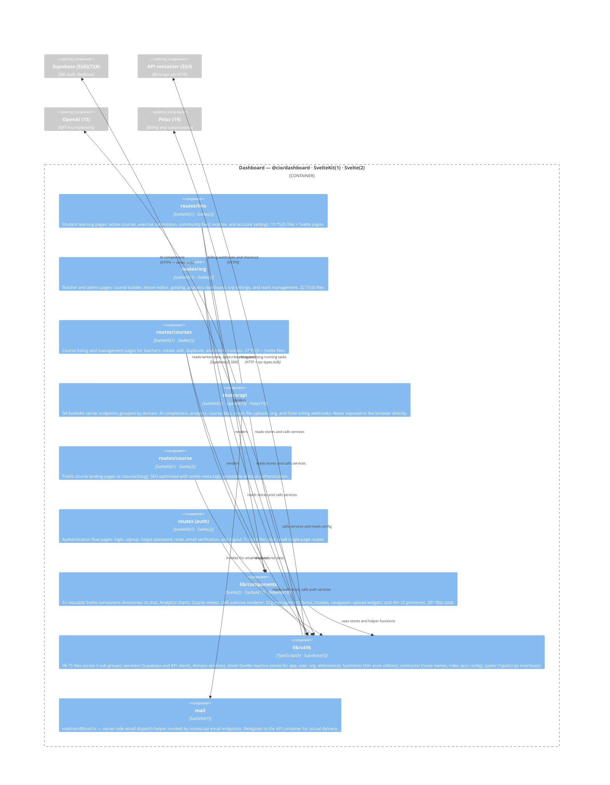

# C4 Level 3 — Dashboard Container Components

> **Scope:** Internal components of `apps/dashboard` (`@cio/dashboard`).  
> **Derived from:** `docs/c4/ast-dashboard.json` (AST extraction at depth=3, 2026-05-15).  
> **Source:** `apps/dashboard/src/` — 432 TS/JS files + 297 Svelte files across 104 depth-3 components,  
> aggregated to depth-2 for diagram readability (9 architectural groups shown).  
> **Depth warnings:** `lib/components/Course` (91 files) and `lib/utils/functions` (52 files) — both are intentionally large; increasing depth=4 would fragment them without benefit.

---

## What is AST?

An **Abstract Syntax Tree (AST)** is a tree-shaped data structure that represents source code structure without whitespace, comments, or syntactic sugar. Every construct in the language — an `import` statement, a function definition, a class declaration — becomes a node, with children representing its sub-constructs.

This diagram was derived by running `ts-morph` (a TypeScript compiler API wrapper) over every `.ts`/`.js` file in `apps/dashboard/src/`. For each file, the extractor reads its import declarations and resolves each module specifier — including `$lib/...` path aliases read from `tsconfig.json` — to either another file in the codebase (internal) or an npm package name (external). Files are grouped by their first 3 directory segments below `src/` (depth=3). The 104 resulting components are then aggregated one level higher to 9 depth-2 groups for this diagram. `.svelte` files cannot be parsed by ts-morph; they are counted as metadata (`svelteCount`) alongside their co-located `.ts` files.

---

## Tech Stack Footnotes

| # | Technology | Description |
|---|-----------|-------------|
| 1 | **SvelteKit 1.x** | Full-stack Svelte framework with file-based routing (`src/routes/`), server-side rendering, server actions (`+page.server.ts`), and API endpoints (`+server.ts`). Provides the routing backbone for all LMS, org, course, auth, and API route groups. |
| 2 | **Svelte 4** | Reactive UI component compiler that outputs vanilla JavaScript with zero runtime framework overhead. All 51 component directories under `lib/components/` are Svelte 4 `.svelte` files using `$:` reactive declarations and `<script lang="ts">`. |
| 5 | **Supabase** | Open-source Firebase alternative providing managed PostgreSQL, Auth, Realtime, and Storage. The Dashboard's `lib/utils` services layer wraps `@supabase/supabase-js` for all data access and uses Supabase Realtime for live feed subscriptions. |
| 6 | **PostgreSQL** | Relational database backing all persistent data. Accessed exclusively through the Supabase JS SDK from `lib/utils/services` — no raw SQL from the Dashboard. |
| 7 | **Supabase Auth** | JWT-based authentication. The Dashboard uses `@supabase/supabase-js` to manage sessions, protected routes check the session in SvelteKit hooks (`src/hooks.server.ts`), and the auth store exposes the user to all components. |
| 8 | **Supabase Realtime** | WebSocket subscriptions to PostgreSQL row changes. Used in `lib/utils/services` to push live updates to the org feed and notification bell without polling. |
| 9 | **TypeScript** | Statically typed superset of JavaScript used for all Dashboard source files. The `rpc-types.ts` import from `@cio/api` gives compile-time types for all API container calls made from `routes/api`. |
| 13 | **OpenAI GPT-4** | Completions API used for AI grading, exercise generation, and custom prompts. Accessed exclusively from `routes/api/completion/` server endpoints — never from Svelte components or browser code. |
| 17 | **Carbon Design System** | IBM's open-source design system providing Svelte components (`carbon-components-svelte`) and data visualisation (`@carbon/charts-svelte`). Used for tables, data grids, and analytics charts in the org admin and analytics views. |
| 18 | **Tailwind CSS** | Utility-first CSS framework providing base styling for all Dashboard pages and components. Configured with `@tailwindcss/forms` and `@tailwindcss/typography` plugins. |
| 19 | **Polar** | Open-source billing and subscription platform. The `routes/api/polar/` endpoints handle checkout sessions, subscription webhooks, and the customer portal via `@polar-sh/sveltekit`. |
