# C4 Layer 3 — Dashboard container

Components inside `apps/dashboard` (SvelteKit 4). Derived from AST extraction
(`docs/c4/components.json`, depth=5), then aggregated to ~20 nodes for
readability. Regenerate the raw extraction with
`node .claude/skills/c4-model/scripts/extract-components.mjs` whenever the
source layout changes.

```mermaid
C4Component
  title ClassroomIO Dashboard — Component view

  Person(teacher, "Teacher / Admin", "Uses /courses; /org; /lms")
  Person(student, "Student", "Uses /lms; /course; /invite")

  Container_Boundary(dashboard, "Dashboard (SvelteKit 4)") {
    Component(routes_courses, "Course mgmt routes", "SvelteKit", "/courses/[id]/* — 27 files; lessons; people; analytics; submissions; marks; attendance; certificates")
    Component(routes_org, "Org routes", "SvelteKit", "/org/[slug]/* — 22 files; audience; community; team; settings")
    Component(routes_lms, "LMS routes", "SvelteKit", "/lms/* — 10 files; student learning UI")
    Component(routes_auth, "Auth routes", "SvelteKit", "login; signup; logout; forgot; reset; verify-email-error")
    Component(routes_invite, "Invite routes", "SvelteKit", "/invite/s/[hash]; /invite/t/[hash]")
    Component(routes_public_course, "Public course route", "SvelteKit", "/course/[slug] — public course view")
    Component(routes_api_completion, "AI completion routes", "SvelteKit server", "/api/completion/* — OpenAI Edge")
    Component(routes_api_email, "Email routes", "SvelteKit server", "/api/email/* — uses mail templates")
    Component(routes_api_polar, "Polar webhook", "SvelteKit server", "/api/polar/* — Polar subscription handler")
    Component(routes_api_misc, "Other server routes", "SvelteKit server", "16 misc /api/* endpoints")

    Component(comp_course, "Course components", "Svelte", "lib/components/Course — 91 files; lesson editor; sections; etc.")
    Component(comp_org, "Org components", "Svelte", "lib/components/Org — 46 files")
    Component(comp_landing, "Course landing page", "Svelte", "lib/components/CourseLandingPage — 19 files")
    Component(comp_apps, "Apps (polls; quiz)", "Svelte", "lib/components/Apps — 15 files")
    Component(comp_misc, "Shared UI components", "Svelte + Carbon", "lib/components — 120 files across 58 dirs: Form; Navigation; Icons; Page; Snackbar; TextEditor; …")

    Component(utils_functions, "Utility functions", "TypeScript", "lib/utils/functions — 52 files; pure helpers")
    Component(utils_services, "Data services", "TypeScript", "lib/utils/services — 21 files; supabase queries")
    Component(utils_store, "Svelte stores", "Svelte writable stores", "userStore; globalStore; org/course context")
    Component(utils_misc, "Constants / types / i18n", "TypeScript", "lib/utils/constants; types; misc — including PostHog client; i18n setup")

    Component(mocks, "Editor language mocks", "TypeScript", "lib/mocks — 221 files; CodeMirror seed snippets for js/ts/py/php/react/css/html/git/node/vue")
    Component(mail_templates, "Email templates", "Svelte email", "mail/ — components consumed by /api/email")
  }

  ContainerDb(db, "Supabase Postgres", "Postgres + RLS", "Direct reads/writes via Supabase JS")
  Container(api, "API container", "Hono / Node", "Async tasks")
  System_Ext(supabase_auth, "Supabase Auth", "Sessions")
  System_Ext(openai, "OpenAI", "AI completions")
  System_Ext(polar, "Polar", "Subscriptions")
  System_Ext(stripe, "Stripe", "Legacy billing")
  System_Ext(posthog, "PostHog", "Analytics")
  System_Ext(senja, "Senja", "Testimonials widget")

  Rel(teacher, routes_courses, "Uses")
  Rel(teacher, routes_org, "Uses")
  Rel(student, routes_lms, "Uses")
  Rel(student, routes_public_course, "Views")
  Rel(student, routes_invite, "Joins via")

  Rel(routes_courses, comp_misc, "Renders (54)")
  Rel(routes_courses, comp_course, "Renders (19)")
  Rel(routes_courses, utils_functions, "Calls (12)")
  Rel(routes_courses, utils_services, "Calls (10)")
  Rel(routes_org, comp_misc, "Renders (40)")
  Rel(routes_org, comp_org, "Renders (13)")
  Rel(routes_org, utils_store, "Reads (14)")
  Rel(routes_org, utils_functions, "Calls (15)")
  Rel(routes_lms, comp_misc, "Renders (27)")
  Rel(routes_lms, utils_functions, "Calls (8)")
  Rel(routes_auth, comp_misc, "Renders (15)")

  Rel(routes_api_misc, utils_functions, "Calls (14)")
  Rel(routes_api_email, mail_templates, "Renders (11)")

  Rel(comp_course, comp_misc, "Composes (138)")
  Rel(comp_org, comp_misc, "Composes (89)")
  Rel(comp_landing, comp_misc, "Composes (33)")
  Rel(comp_apps, comp_misc, "Composes (19)")

  Rel(comp_course, utils_functions, "Calls (45)")
  Rel(comp_course, utils_services, "Calls (22)")
  Rel(comp_course, utils_store, "Reads (25)")
  Rel(comp_org, utils_functions, "Calls (26)")
  Rel(comp_org, utils_store, "Reads (25)")
  Rel(comp_misc, utils_functions, "Calls (44)")
  Rel(comp_misc, utils_store, "Reads (20)")

  Rel(mocks, utils_misc, "Types (211)")

  Rel(utils_services, db, "Queries", "Supabase JS / RLS")
  Rel(utils_services, supabase_auth, "Sessions", "HTTPS")
  Rel(comp_misc, api, "Async tasks", "Hono RPC")
  Rel(routes_api_completion, openai, "Streams", "HTTPS")
  Rel(routes_api_polar, polar, "Webhook", "HTTPS")
  Rel(comp_misc, stripe, "Checkout", "HTTPS")
  Rel(utils_misc, posthog, "Events", "HTTPS")
  Rel(comp_misc, senja, "Embed", "HTTPS")
```

## Aggregation key

`apps/dashboard/src/` extracted at depth 5 yields 202 raw components — too many for one diagram. The diagram groups them into ~22 nodes:

| Node | Maps to (extractor keys) | Files |
|---|---|---:|
| `routes_courses` | `routes/courses/*` | 27 |
| `routes_org` | `routes/org/*` | 22 |
| `routes_lms` | `routes/lms/*` | 10 |
| `routes_auth` | `routes/{login,signup,logout,forgot,reset,verify-email-error}` | 6 |
| `routes_invite` | `routes/invite/*` | 4 |
| `routes_public_course` | `routes/course/*` | 2 |
| `routes_api_completion` | `routes/api/completion` | 4 |
| `routes_api_email` | `routes/api/email` | 11 |
| `routes_api_polar` | `routes/api/polar` | 3 |
| `routes_api_misc` | `routes/api/*` (remaining) | 16 |
| `comp_course` | `lib/components/Course/**` | 91 |
| `comp_org` | `lib/components/Org/**` | 46 |
| `comp_landing` | `lib/components/CourseLandingPage` | 19 |
| `comp_apps` | `lib/components/Apps` | 15 |
| `comp_misc` | rest of `lib/components/**` | 120 |
| `utils_functions` | `lib/utils/functions` | 52 |
| `utils_services` | `lib/utils/services` | 21 |
| `utils_store` | `lib/utils/store` | 5 |
| `utils_misc` | `lib/utils/{constants,types,misc}` | 19 |
| `mocks` | `lib/mocks/**` (CodeMirror seed snippets) | 221 |
| `mail_templates` | `mail/` | 1 |

Edges in the diagram show the *aggregated* import counts (sum of per-file imports) and the most load-bearing connections (count ≥ 8). Low-signal edges are omitted to keep the picture readable — refer back to `components.json` for the full relations array.
