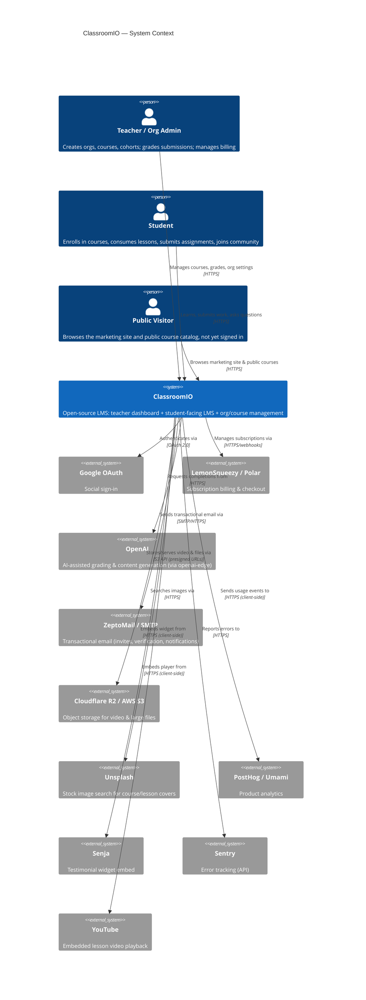

# Layer 1 — System Context

Hand-authored from repo inspection (`CLAUDE.md`, `package.json` dependencies across `apps/*`) — there's no AST source of truth at this layer. Re-derive rather than trust blindly if the stack has changed; check `apps/*/package.json` for current integrations.

