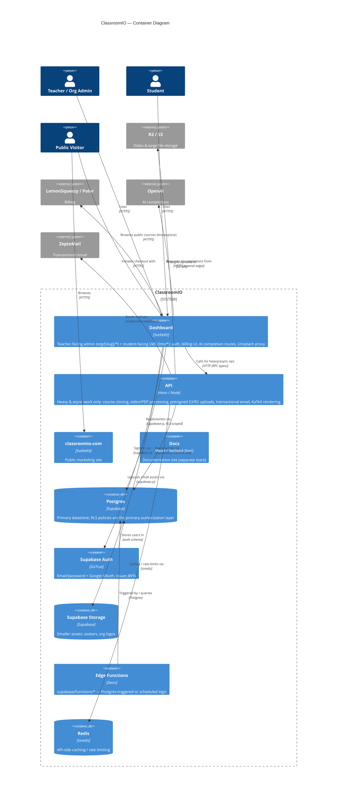

# Layer 2 — Container

Hand-authored from repo inspection (`CLAUDE.md`, `pnpm-workspace.yaml`, `apps/*`, `supabase/`) — no AST source of truth at this layer. Re-derive if the monorepo layout changes; see `CLAUDE.md` "Monorepo layout" for the authoritative app/package list.

