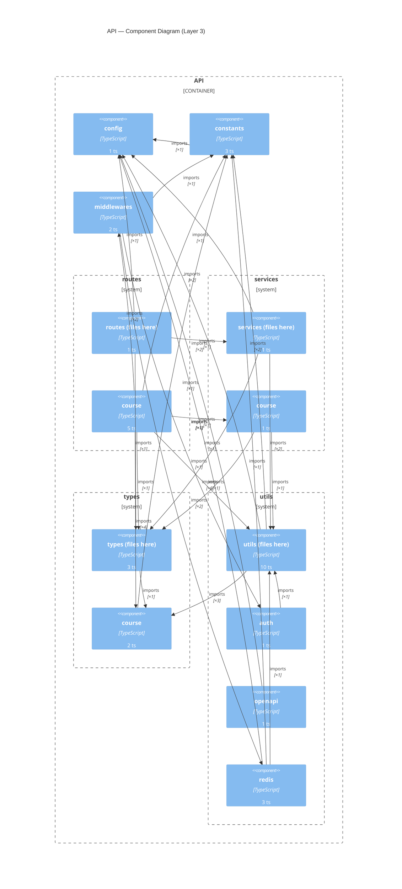

# Layer 3 — API Component Diagram

Derived from the codebase AST (ts-morph), not hand-authored. Regenerate after structural changes:

```bash
pnpm exec tsx .claude/skills/c4-model/scripts/extract-components.ts api --depth=2
pnpm exec tsx .claude/skills/c4-model/scripts/render-mermaid.ts api
```

Generated: 2026-09-11T08:06:54.069Z · depth: 2 · source: `apps/api/src`


