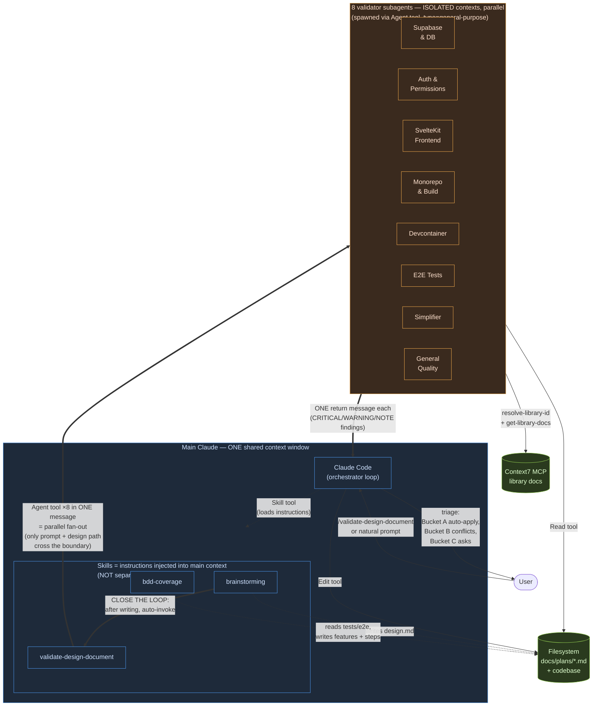

# Skills & Agents Flow

> How Claude Code orchestrates skills, subagents, and external context in this repo.
> Scope: the meta-system that produces and validates design docs — not the product itself.

## Diagram

## Reading the diagram

**Three context boundaries, color-coded:**

| Color | What it is | Lifetime |
|-------|------------|----------|
| Blue  | Main Claude conversation — single context window, persists across the whole session | Whole session |
| Orange | Subagent contexts — one per validator, isolated, single-shot | One Agent call |
| Green | External stores — filesystem and MCP servers | Persistent |

**Two arrow styles:**

- `-.->` dotted = lightweight (loading instructions, reading/writing files)
- `==>` bold = the critical handoffs where context shape matters (skill → skill auto-invocation, main → subagent fan-out, subagent → main return)

## What this shows

1. **Skills ≠ agents.** Skills are *instruction files* loaded into the main Claude's context — same conversation, same context window. The `Skill` tool just injects the skill's markdown.

2. **Agents = isolated.** Each of the 8 validators runs in its own context. They cannot see the main conversation. The only thing that crosses the boundary inbound is the **prompt string** passed via the `Agent` tool; the only thing that crosses outbound is **one return message**.

3. **Parallelism = one tool-call message with N `Agent` blocks.** Spawning 8 `Agent` calls inside a single assistant message makes them run simultaneously — total wall time ≈ slowest validator, not sum of all.

4. **"Close the loop"** = make `brainstorming` end by automatically invoking `validate-design-document` on the freshly written doc, so the human doesn't have to remember.

5. **Context7 is hit per-validator, not centrally.** Each subagent looks up its own library docs (Supabase, Playwright, SvelteKit…). Parallelism matters here — the doc lookups don't queue.

6. **Filesystem is the shared substrate.** Both skills and subagents read/write through it — that's how the design doc gets handed between them.

## Concrete example: the `/validate-design-document` run on 2026-05-28

1. User invokes `/validate-design-document` (no path arg).
2. Main Claude loads the skill's instructions via the `Skill` tool.
3. Main Claude picks the most recent file in `docs/plans/` (`2026-05-15-bdd-coverage-design.md`).
4. Main Claude snapshots it (`cp design.md design.before.md`) so `diff` works later.
5. Main Claude reads the 8 validator prompt files in parallel from `.claude/skills/validate-design-document/validators/`.
6. Main Claude emits **one assistant message containing 8 `Agent` tool calls** — they run in parallel.
7. Each subagent: reads design doc → reads codebase files relevant to its lens → queries Context7 for current library docs → returns one report.
8. Main Claude collects all 8 reports, triages into auto-apply / conflicts / asks-user, and presents to the user.

## Files

- Skills live at `.claude/skills/<name>/SKILL.md` (or `<name>.md`).
- Validator prompts live at `.claude/skills/validate-design-document/validators/*.md`.
- Design docs land in `docs/plans/<date>-<topic>.md`.
- This diagram lives at `docs/skills-flow.md`.
